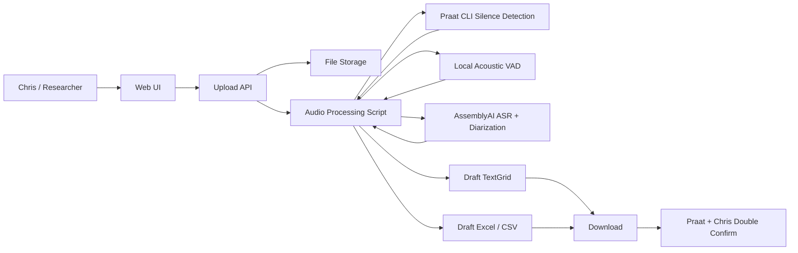

# Fluency/Vocabulary Audio Pre-Annotation MVP Architecture

版本：v0.4  
日期：2026-06-13  
状态：双 sounding/silence 参考层校正版项目启动架构

## 1. 一句话定位

这个系统不是研究分析平台，也不是替代 Praat 的工具。

它只是一个 Web UI 辅助入口：研究人员上传 audio，系统分别生成两条 `sounding/silence` 参考层：一条来自 Praat CLI，一条来自 Local VAD / Praat-style detection。系统再用 ASR / speaker diarization 生成 transcript 和 speaker 草稿，并自动标出两条 sounding/silence 参考层不一致、低置信度、重叠说话等需要 Chris 检查的区域。之后 Chris 必须在真实 Praat 中打开音频和 TextGrid，校验、修正、double confirm。最终论文数据来自 Chris 确认后的 reviewed TextGrid/Excel，而不是 Praat 自动层、Local VAD 自动层或 AI 原始输出。

更准确地说：

- TextGrid 是给 Praat 打开的主草稿文件。
- Excel/CSV 是给 Chris 检查、整理和后续研究统计的辅助表。
- 不是“把 TextGrid 喂给 Praat，让 Praat 自动生成最终 Excel”。
- 正确流程是“音频 + draft TextGrid 在 Praat 里人工校验；Excel/CSV 要么由同一份 draft 标注同步生成，要么在 Chris 校验后从 reviewed TextGrid 再导出”。
- 绝不能在实际未使用 Praat 人工校验的情况下，对外声称最终研究数据是 Praat 校验结果。

## 2. 为什么要这样做

Chris 现在最耗时的是从零开始听音频、找 sounding/silence、对齐 transcript、整理到 Excel。AI 可以帮助生成第一版草稿，减少重复劳动。

但为了避免研究报告不真实，系统必须明确：

- AI/Web UI 只做辅助预处理。
- Praat 仍然是最终校验和学术链路的一部分。
- Chris 必须 double confirm。
- 论文方法里应披露使用了自动工具生成 preliminary annotations。
- 最终分析必须基于人工校验后的 TextGrid/Excel。
- `sounding/silence` 是 pause/fluency 的核心因变量。MVP 同时提供 Praat 自动层和 Local VAD 自动层作为参考；两者不一致时标入 `sounding_silence_review_status`，由 Chris 在 Praat 中确认。不能把 ASR word timestamps 当作最终 pause boundary。

## 3. MVP 目标

第一版只做一件事：

上传一段多人英语对话音频，然后生成两个可下载文件：

1. `*.TextGrid`
   - Praat 可直接打开。
   - 包含时间区间、speaker、transcript、review flag 等草稿标注。

2. `*.xlsx` 或 `*.csv`
   - 给 Chris 检查和后续分析。
   - 包含 start time、end time、duration、speaker、transcript、review_status 等字段。

第一版不做：

- 不做完整研究 dashboard。
- 不做复杂项目权限。
- 不做最终论文指标自动计算。
- 不做替代 Praat 的完整编辑器。
- 不承诺 AI 输出就是最终结果。

## 3.1 Praat 到底负责什么

Praat 的核心功能不是“读一段普通文本然后自动完成研究分析”。它主要负责：

- 打开音频并显示 waveform、spectrogram、pitch、intensity 等声学视图。
- 创建或读取 TextGrid。
- 在 TextGrid 里编辑时间边界、interval label、point label 和 tier。
- 支持研究人员反复播放某个区间，手动修正边界和标签。
- 可以通过内置命令或脚本生成一些自动标注，例如 silence/sounding 或 speech/non-speech。
- 可以用脚本从 TextGrid 读取 start/end/label 等字段，再导出成表格格式。

所以 Chris 展示的 Excel 大概率是研究用的“segment/utterance table”：

- 一句或一个片段一行。
- 每行包含 start time、end time、duration、transcript、speaker、label 等字段。
- 它可能来自 Praat/TextGrid 导出，也可能来自 Chris 现有人工整理流程。

我们现在必须向 Chris 要一份样例 Excel 和样例 TextGrid，确认它们之间的对应关系。否则不能假设 Excel 的每一行一定等于 TextGrid 的某个 tier interval。

## 4. 最简系统架构



注意：这里的 Praat 环节不是模型继续自动分析，而是 Chris 打开 `audio + draft.TextGrid` 做人工确认。

## 5. 实际工作流

### Step 1: 上传音频

用户在 Web UI 上传音频文件。

支持格式：

- `.wav`
- `.mp3`
- `.flac`
- `.m4a`

MVP 建议限制：

- 单文件不超过 200MB。
- 优先测试 5-10 分钟音频。
- 后端统一转成 16kHz mono WAV 供模型处理。

### Step 2: Praat 自动层 + Local VAD + AssemblyAI

系统对音频做自动预处理：

- Praat CLI：生成 `praat_sounding_silence` 自动参考层。
- Local acoustic VAD / Praat-style detection：生成 `local_vad_sounding_silence` 自动参考层。
- Sounding/silence comparison：比较 Praat 自动层和 Local VAD 自动层，把不一致的区间写入 `sounding_silence_review_status`。
- AssemblyAI ASR：生成英文 transcript 初稿和 word-level timestamps，用于把 transcript 填到 TextGrid/Excel。
- AssemblyAI speaker diarization：区分不同说话人，生成 speaker tier 初稿。
- Optional LLM：整理 transcript、标记低置信度片段、生成 Excel 字段。

注意：Praat 自动层和 Local VAD 自动层都不是最终真值；它们是给 Chris 比对和校验的参考。AssemblyAI 不负责最终判断 pause duration。LLM 不负责最终判断 pause duration、speaker ownership 或 fluency metrics。它们只负责辅助整理和预标注。

### Step 3: 生成 TextGrid 草稿

系统生成 Praat 可用的 TextGrid。

建议 review TextGrid 使用 6 个 tier。Praat 中 tier 名称必须唯一，所以不要把 Tier 1 和 Tier 2 都命名成 `sounding_silence`；用来源前缀区分。

| Tier | 内容 | 说明 |
| --- | --- | --- |
| `praat_sounding_silence` | `sounding` / `silence` | Praat CLI 自动生成的 sounding/silence 参考层 |
| `local_vad_sounding_silence` | `sounding` / `silence` | Local VAD / Praat-style detection 生成的 sounding/silence 参考层 |
| `sounding_silence_review_status` | `pending:*` / empty | 系统自动标记 Tier 1 和 Tier 2 不一致、边界差异过大、需要 Chris 检查的区间 |
| `speaker` | `speaker_1` / `speaker_2` / `speaker_3` / `unknown` / `overlap` | AssemblyAI diarization 生成草稿，给 Chris 校验说话人 |
| `transcript` | 英文转写文本 | AssemblyAI ASR 生成草稿，可后续用 forced alignment/MFA 改善文本时间对齐 |
| `review_status` | `pending:*` / `confirmed:*` / `fixed:*` / `exclude:*` | 系统自动标记 ASR 低置信度、speaker 不确定、重叠、边界冲突等；也承载 Chris 的确认状态 |

Chris 校验时的工作方式：

- 对照 `praat_sounding_silence` 和 `local_vad_sounding_silence`。
- 优先检查 `sounding_silence_review_status` 标记的冲突区间。
- 校正 speaker 和 transcript。
- 保存 reviewed TextGrid。

最终统计时应从 Chris-reviewed 文件中导出干净研究层。自动参考层只能作为校验证据，不直接作为最终研究结论。

TextGrid 只是 draft，文件名应明确：

```text
sample_audio.draft.TextGrid
```

Chris 校验后可以另存为：

```text
sample_audio.reviewed.TextGrid
```

### Step 4: 生成 Excel/CSV 草稿

Excel/CSV 主要是方便查看和后续统计。

MVP 字段：

| 字段 | 说明 |
| --- | --- |
| `file_name` | 原始音频名 |
| `segment_id` | 片段 ID |
| `start_time` | 开始时间，秒 |
| `end_time` | 结束时间，秒 |
| `duration` | 时长 |
| `speaker` | speaker_1 / speaker_2 / speaker_3 / unknown / overlap |
| `label` | sounding / silence / utterance |
| `transcript` | 转写文本 |
| `confidence` | 模型置信度 |
| `review_status` | 空 / pending:* / confirmed:* / fixed:* / exclude:* |
| `human_reviewed` | 从 reviewed TextGrid 的 review_status 解析 |
| `notes` | 人工备注 |

文件名：

```text
sample_audio.draft.xlsx
sample_audio.draft.csv
```

## 6. Web UI 需要多简单

MVP 页面只需要 3 个区域：

### 6.1 Upload

- 选择音频。
- 显示文件名、大小、格式。
- 点击 `Process audio`。

### 6.2 Processing Status

显示当前状态：

- Uploaded
- Converting audio
- Running Praat silence detection
- Running local acoustic VAD
- Running AssemblyAI ASR/diarization
- Comparing sounding/silence references
- Generating TextGrid
- Generating Excel
- Completed
- Failed

### 6.3 Download

完成后提供下载：

- Draft TextGrid
- Draft Excel/CSV
- Processing log

Processing log 是为了论文真实性和复现，不是给普通用户看的复杂功能。

## 7. 后端需要多简单

MVP 后端可以先做成单机服务：

```text
React Web UI
  -> Node/Express or Hono API
    -> Save uploaded audio
    -> Run Python processing script
    -> Return output file links
```

不必一开始上复杂队列。可以先同步或半异步：

- 5-10 分钟音频：可以先用一个 processing job 状态文件。
- 后续全量数据再升级成 queue/worker。

建议目录：

```text
storage/
  uploads/
    sample_audio.wav
  outputs/
    sample_audio.draft.TextGrid
    sample_audio.draft.xlsx
    sample_audio.method-log.json
  temp/
```

## 8. 处理脚本职责

建议用 Python 脚本负责音频处理和文件生成：

```text
scripts/process_audio.py
```

输入：

```text
audio file path
output directory
optional model config
```

输出：

```text
draft TextGrid
draft Excel/CSV
method-log.json
```

脚本内部流程：

1. 用 ffmpeg 标准化音频。
2. 调用 Praat CLI，生成 `praat_sounding_silence` 参考层。
3. 运行 local acoustic VAD，生成 `local_vad_sounding_silence` 参考层。
4. 比较两条 sounding/silence 参考层，生成 `sounding_silence_review_status`。
5. 调用 AssemblyAI，生成 transcript/speaker 草稿。
6. 合并 tier 并标记通用 `review_status`。
7. 生成 TextGrid。
8. 生成 Excel/CSV。
9. 生成 method-log。

## 9. AI / 模型边界

系统可以调用一个或多个模型：

- Praat CLI silence detection：负责 `praat_sounding_silence` 参考层。
- Local acoustic VAD：负责 `local_vad_sounding_silence` 参考层。
- Rule-based comparison：负责 `sounding_silence_review_status` 冲突层。
- AssemblyAI ASR：负责 transcript 草稿。
- AssemblyAI speaker diarization：负责说话人分离草稿。
- LLM：负责整理输出、标记疑点、格式化 Excel。

但论文和产品都必须坚持：

```text
AI output = preliminary draft
Chris/Praat confirmed output = final research data
```

## 10. Method Log

为了避免研究报告不真实，每次处理都要生成一个简单日志：

```json
{
  "input_file": "sample_audio.wav",
  "output_textgrid": "sample_audio.draft.TextGrid",
  "output_excel": "sample_audio.draft.xlsx",
  "created_at": "2026-06-12T00:00:00Z",
  "audio_normalization": {
    "sample_rate": 16000,
    "channels": 1,
    "format": "wav"
  },
  "models_used": {
    "asr": {
      "provider": "assemblyai",
      "model": "tbd",
      "version": "tbd"
    },
    "vad": {
      "provider": "local_acoustic_vad",
      "model": "energy_or_intensity_threshold",
      "version": "tbd"
    },
    "praat_silence_detection": {
      "provider": "praat_cli",
      "model": "Sound: To TextGrid (silences)",
      "version": "tbd",
      "parameters": "tbd"
    },
    "sounding_silence_comparison": {
      "provider": "rule_based",
      "version": "tbd",
      "policy": "Flag intervals where Praat auto layer and local VAD layer disagree."
    },
    "speaker_diarization": {
      "provider": "assemblyai",
      "model": "tbd",
      "version": "tbd"
    },
    "llm_helper": {
      "provider": "tbd",
      "model": "tbd",
      "version": "tbd"
    }
  },
  "human_review_required": true,
  "final_data_policy": "Only Chris-reviewed Praat/TextGrid or Excel outputs should be used for final analysis."
}
```

## 11. 推荐论文方法表述

推荐方向：

> Praat-based silence detection and acoustic voice activity detection were used to generate preliminary sounding/silence reference annotations. Disagreements between the two automatic reference annotations were flagged for manual review. Automatic speech recognition and speaker diarization were used to generate preliminary transcript and speaker annotations. The generated annotations were reviewed and corrected manually in Praat. Final fluency and vocabulary analyses were based on the manually verified TextGrid and spreadsheet outputs.

中文意思：

自动工具只是生成初始时间对齐标注和冲突提示；最终数据来自 Chris 在 Praat/Excel 中人工确认后的结果。

## 12. MVP 验收标准

用 `sample-inputs/AMI_ES2002a_Mix-Headset_10min.wav` 测试时，应满足：

- Web UI 可以上传音频。
- 后端可以处理音频。
- 系统生成 `.TextGrid`。
- Praat 可以打开音频和 TextGrid。
- 系统生成 `.xlsx` 或 `.csv`。
- Excel/CSV 里有时间、speaker、transcript、review_status。
- 输出文件名明确标记为 draft。
- method-log 记录模型、版本、参数和人工校验要求。
- Chris 能用 Praat 对 TextGrid 做 double confirm。

## 13. 第一阶段开发清单

### Frontend

- 上传音频按钮。
- 文件信息展示。
- 处理状态展示。
- 下载 TextGrid。
- 下载 Excel/CSV。
- 下载 method-log。

### Backend

- 音频上传接口。
- 保存文件到 `storage/uploads`。
- 调用 `scripts/process_audio.py`。
- 保存输出到 `storage/outputs`。
- 返回下载链接。

### Processing Script

- 读取音频。
- 标准化音频。
- 调用模型。
- 生成 TextGrid。
- 生成 Excel/CSV。
- 生成 method-log。

## 14. 后续再考虑的功能

只有 MVP 跑通后，再考虑：

- 批量上传。
- 项目管理。
- 多用户权限。
- Web 内嵌波形校验。
- Review timeline。
- 自动误差评估。
- 词汇和 multi-word sequence 分析。
- 全量数据处理队列。

## 15. 当前结论

第一版应该非常简单：

```text
Upload audio
  -> Praat auto layer + Local VAD layer + AssemblyAI generate draft TextGrid + draft Excel
  -> System flags disagreements
  -> Chris opens in Praat / Excel
  -> Chris double confirms
  -> confirmed files become research data
```

这个定位最符合当前会议方向，也最容易向 John/Chris 解释清楚：Web UI 和 AI 是辅助工具，不是最终研究结论来源。
