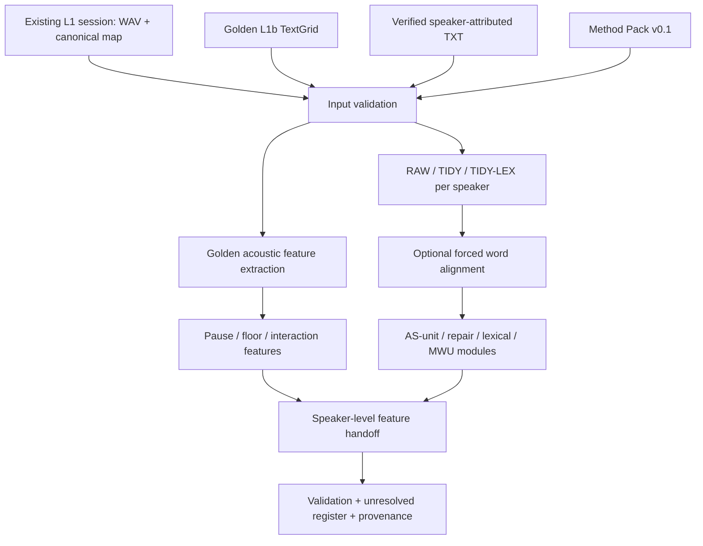

# Layer 2 Provisional Method 与 Layer 3 Handoff 方案

版本：v0.1  
日期：2026-08-24  
状态：可用于工程实现与校准演示；客户定义确认前不标记为 final research release

## 1. 决策摘要

本项目可以只要求客户新增提供以下两项材料，并继续推进 Layer 2：

1. 与录音对应的、经过研究人员人工校正的 Golden L1b TextGrid；
2. 同一录音对应的、经过研究人员确认的 speaker-attributed verbatim transcript TXT。

原始 WAV、L1a canonical speaker mapping 和 L1 session evidence 已由系统保存，不需要客户重复提交。

这两项客户材料足以完成：

- canonical speaker 与 transcript turn 校验；
- TextGrid 与 transcript 的基础对齐；
- per-speaker RAW/TIDY transcript；
- speaker、floor、turn、pause、transition、backchannel 和 excluded-event 特征；
- 可复算的 fluency、repair、lexical、AS-unit candidate 和 MWU candidate 表；
- 面向 Layer 3 的 speaker-level feature handoff。

但 AS-unit、MWU、rate 和 lexical-tool 指标依赖方法定义。客户定义尚未正式确认时，可以由工程团队冻结一套有文献依据、可复现、可替换的 `Method Pack v0.1` 先行计算。所有这类结果必须标记为 `provisional_method_v0.1`，不能冒充客户批准的 Gold research result。

客户邮件已经说明剩余 Golden bundles 和 definition sets 预计随后交付。因此推荐采用两阶段策略：

```text
现在：Golden TextGrid + verified TXT + Method Pack v0.1
  -> 跑通 L2
  -> 生成 provisional L3 matrix
  -> 验证端到端工程链路

客户定义到达后：definition diff
  -> 升级 Method Pack v1.0
  -> 只重算 definition-dependent modules
  -> 重建并验证 L3 matrix
  -> 客户确认后才形成 accepted release
```

## 2. 客户当前材料应如何理解

### 2.1 已提供或已承诺的内容

客户已经提供一个 calibration transcript sample，并说明：

- 使用 canonical speaker labels，如 `S1:`、`S2:`、`S3:`；
- 不包含 line timestamps；
- 保留 fillers、repetitions、false starts 和 repairs；
- 使用 `[bc]` 标记 listener feedback/backchannels；
- annotation conventions guide 同时提供 DOCX 和 PDF；
- 剩余九组 Golden TextGrid、transcript 和 definition sets 正在准备；
- 初始样例对应 `Multilogue04_C_Level30_D1G4_P025_corrected_6tier.TextGrid`。

如果该 corrected TextGrid 不在本地归档中，应接受客户邮件中的提议，请其重新发送。不能仅凭文件名或 annotation guide 假定文件存在。

### 2.2 Annotation guide 的作用

该指南足以确定 transcript 层面的基本约定，例如：

- speaker label 格式；
- fillers、cut-offs、repetitions 和 self-repairs 的保留方式；
- `[bc]` 和 `[x]` 的含义；
- TXT 与 Praat labels 的基本对应关系；
- TextGrid 是 acoustic clock，TXT 是 orthographic clock。

它不是完整的 Layer 2 research definition pack。它没有完整冻结：

- AS-unit/clause boundary policy；
- pause-location classification policy；
- repair/rate denominator；
- MWU operational definition；
- TAALES/TAALED/AntConc 版本和变量列表；
- Layer 2 expected output rows；
- Layer 3 final matrix codebook。

因此，指南可以作为 `transcription_convention_version` 的来源，但不能单独作为全部 Layer 2 指标的研究依据。

## 3. Layer 2 的真实输入边界

### 3.1 每个 recording 的最小输入

```text
Existing L1 session
  - original WAV
  - accepted L1a speaker mapping
  - recording/session identifiers

Customer-reviewed inputs
  - Golden L1b TextGrid
  - verified speaker-attributed transcript TXT

Versioned method input
  - Layer 2 Method Pack
```

也就是说，`Golden TextGrid + verified TXT` 是客户需要提供的两个核心输入，但端到端执行仍会读取系统已有的 WAV 和 L1 session metadata。

### 3.2 输入预检

进入 Layer 2 前至少执行以下检查：

1. `recording_id` 一致；
2. TXT、TextGrid 和 WAV 的录音时长/身份可追溯；
3. TextGrid tier 数量满足动态 `N+3`；
4. speaker tiers 为连续的 `S1...SN`；
5. TXT 中的 participant labels 与 TextGrid speaker tiers 完全一致；
6. `Teacher:` 等 non-participant labels 被识别，但不进入 participant-level 主指标；
7. TextGrid label vocabulary 只使用批准的九类：`s/f/bc/ol/op/pf/tr/shs/x`；
8. TXT 没有丢失客户要求保留的 disfluency evidence；
9. TextGrid 与 TXT 都计算 SHA-256 并写入 manifest；
10. threshold 明确为 P025 或 P035，不能在同一组指标中混用。

### 3.3 Word-level timing 的边界

Golden L1b TextGrid 提供的是 acoustic interval evidence，不一定提供逐词时间。

- 不涉及 word-level timing claim 的指标，可以直接由 Golden TextGrid 和 TXT 计算；
- 涉及 pause-before/inside/after-MWU 或逐词 pause-location 的指标，需要 word alignment；
- 可以使用系统保存的 WAV 和 verified TXT 运行 MFA/forced alignment；
- 自动生成的 word alignment 必须标记为 `machine_aligned_unreviewed`；
- 未经人工 review，不得称为 Golden word timing；
- 对齐无法支持的字段保留 `null/pending`，不能填零。

## 4. Layer 2 Method Pack v0.1

### 4.1 方法版本原则

每次运行必须记录：

- `method_pack_version`；
- `transcription_convention_version`；
- `textgrid_schema_version`；
- pause threshold；
- AS-unit rule source；
- repair rule source；
- rate formulas；
- MWU rule和target/list版本；
- lexical tool name/version/selected variables；
- input/output hashes；
- unresolved assumptions。

客户定义到达后，不覆盖 v0.1，而是生成 v1.0，并保留两次运行的 delta。

### 4.2 Transcript views

为不同分析目的保留三种视图：

#### RAW-VERBATIM

- 完整保留客户 TXT；
- 保留 fillers、repetitions、false starts、repairs；
- 保留 `[bc]` 和 `[x]`；
- 保留 `Teacher:`；
- 只允许标准化行尾和无意义的多余空格。

#### TIDY-PHRASE

- 按 speaker 汇总 turns；
- 保留 lexical repetitions 和 repair evidence；
- 非词汇性 filler 的删除必须写入 transformation log；
- 不允许静默修正文法或替换客户原词。

#### TIDY-LEX

- 用于 TAALES、TAALED、AntConc；
- 排除 `Teacher:` 和 `[x]` utterances；
- 移除 `[bc]`、`[x]` 等 annotation tags；
- backchannel token 作为 interaction feature 单独统计，默认不混入主 speaker lexical analysis；
- 移除 non-lexical fillers，但保留其 RAW 位置和计数；
- 每个删除/保留动作可追溯到 RAW token。

### 4.3 Speaker 与 interaction policy

- `S1...SN` 是 participant-level matrix 的 canonical speakers；
- `Teacher`、room noise 和 `[x]` 不形成 participant rows；
- `[bc]` 是 listener interaction event，不自动等价于 floor takeover；
- overlap、floor、transition 等时间指标以 Golden TextGrid 为准；
- transcript label 不能覆盖 TextGrid floor evidence；
- speaker mismatch 必须阻塞该 recording，而不是猜测映射。

### 4.4 Pause policy

主分析使用 P025：

```text
qualifying silent pause = Golden TextGrid interval label == op
                          and duration >= 0.25 seconds
```

P035 用于 sensitivity analysis：

```text
secondary pause = Golden TextGrid interval label == op
                  and duration >= 0.35 seconds
```

规则：

- P025 和 P035 分别计算并保留 threshold 字段；
- 若客户只review了P025，则P025作为唯一Golden分析；
- P035可作为系统重算的sensitivity结果，但不能称为客户reviewed；
- pause count、duration、mean和density均记录明确分母；
- `op/tr/shs/pf` 不可混成一个silent-pause指标。

250–300 ms作为L2 fluency pause threshold具有公开研究依据，v0.1将0.25秒作为主阈值，同时与当前P025流程保持一致。

### 4.5 AS-unit 与 clause policy

v0.1采用Foster、Tonkyn与Wigglesworth提出的AS-unit框架：一个speaker的独立clause或可恢复的subclausal unit，加上与其关联的subordinate clause(s)。

工程实现要求：

- 自动模块输出 `as_unit_candidates.csv`；
- 每条candidate保留source speaker和source turn；
- 明确输出boundary reason；
- 对fragment、coordination、repair-crossing boundary等困难情况标记`review_required`；
- 自动划分结果是method-derived，不是人工Gold；
- 未解决边界写入`unresolved_items.csv`。

### 4.6 Repair policy

v0.1根据客户指南中的显式符号计算：

- filler count；
- adjacent exact repetition count；
- cut-off/truncated lexeme count；
- false-start candidate count；
- repair candidate count；
- `[bc]` count；
- `[x]` excluded-event count。

建议同时输出raw count和标准化指标：

```text
events_per_100_words = event_count / eligible_lexical_word_count * 100
events_per_minute = event_count / eligible_speaking_time_minutes
```

所有eligible token/time定义写入codebook。

### 4.7 Rate policy

至少输出：

- lexical word count；
- active vocal duration；
- floor-run duration；
- qualifying own-pause duration；
- speech rate；
- articulation rate；
- pause density。

建议v0.1公式：

```text
speech_rate_wpm = eligible_lexical_words / floor_run_minutes
articulation_rate_wpm = eligible_lexical_words / active_vocal_minutes
pause_density_per_100_words = qualifying_own_pause_count / eligible_lexical_words * 100
```

注意：是否把`f/bc/ol`计入active vocal denominator必须写死在method pack。v0.1应把backchannel作为独立interaction feature，避免它改变主speaker lexical fluency；如果为兼容现有实现选择不同分母，必须以不同字段名输出，不能复用同一指标名。

### 4.8 Lexical tools policy

v0.1建议锁定：

- TAALES 2.2 stable；
- TAALED 1.4.1；
- AntConc 4.4.2。

执行规则：

- 输入使用per-speaker `TIDY-LEX.txt`；
- 保存工具版本和完整configuration；
- 保存工具原始CSV，不只保留挑选后的列；
- codebook中列出进入final matrix的selected variables；
- TAALES优先保留frequency/range和n-gram frequency/association类别；
- TAALED保留工具提供的主要lexical-diversity输出，同时记录token count；
- 短文本不擅自补值，输出`short_text_interpretation_warning`；
- 工具无法计算的变量保持`null`并记录原因。

### 4.9 MWU operational rule v0.1

现有代码中的十条fixture target list只能用于工程测试，不能作为正式MWU标准。

在客户definition sets到达前，v0.1采用frequency-driven lexical-bundle方案：

- contiguous 3–5 word n-grams；
- case-insensitive；
- 从TIDY-LEX corpus提取；
- whole corpus raw frequency至少3；
- range至少2个recordings或2个canonical speakers；
- 输出raw frequency、normalized frequency和range；
- 不因为序列语法不完整而自动排除；
- `[bc]/[x]`和Teacher文本不参与提取；
- MWU跨越speaker turn时不合并；
- 规则、corpus size和阈值记录在method pack。

这里的`frequency >= 3`和`range >= 2`是针对小型10-recording corpus的项目级选择，不是通用学术定律。必须保留为可配置且可替换的method definition。

## 5. Layer 2处理流程



### 5.1 模块状态

每个模块输出以下状态之一：

- `gold`：客户人工提供的原始证据；
- `gold_derived`：从Golden evidence确定性重算；
- `provisional_method_v0.1`：依赖我们冻结的方法；
- `machine_aligned_unreviewed`：依赖自动word timing；
- `review_required`：生成了candidate但需要研究判断；
- `pending_client_definition`：没有足够方法定义；
- `unsupported`：当前输入无法支持；
- `failed`：执行或验证失败。

## 6. Layer 2输出契约

建议每个recording产生：

```text
inputs/
  input_manifest.json
  method_pack_v0.1.json
  recording_metadata.json

outputs/transcript/
  S1_RAW-VERBATIM.txt
  S1_TIDY-PHRASE.txt
  S1_TIDY-LEX.txt
  S2_...
  transformation_log.json

outputs/word-alignment/
  analysis_word_timing.csv
  alignment_provenance.json

outputs/features/
  as_unit_candidates.csv
  pause_location_candidates.csv
  speaker_fluency_features.csv
  lexical_features.csv
  repair_features.csv
  mwu_occurrences.csv
  interaction_features.csv
  unresolved_items.csv

outputs/handoff/
  early_phase_v_merge.csv

reports/
  validation_report.json
  validation_report.md
  artifact_manifest.json
```

### 6.1 `early_phase_v_merge.csv` 的粒度

```text
一行 = recording_id + canonical speaker + method/threshold version
```

至少包含：

| 字段组 | 示例 |
|---|---|
| Identity | `recording_id`, `participant_id`, `speaker_id` |
| Version | `textgrid_hash`, `transcript_hash`, `method_pack_version`, `threshold_seconds` |
| Timing | `active_vocal_duration_sec`, `floor_run_duration_sec`, `own_pause_duration_sec` |
| Fluency | `word_count`, `speech_rate_wpm`, `articulation_rate_wpm`, `pause_density` |
| Interaction | `turn_count`, `backchannel_count`, `overlap_duration_sec`, `transition_count` |
| Syntax | `as_unit_count`, `clause_count`, `unresolved_boundary_count` |
| Repair | `filler_count`, `repetition_count`, `false_start_count`, `repair_count` |
| Lexical | selected TAALES/TAALED fields plus token count |
| MWU | `mwu_type_count`, `mwu_token_count`, `mwu_rate_per_100_words` |
| Alignment | `word_alignment_status`, `word_alignment_support_ratio` |
| QA | `unresolved_item_count`, `record_status`, `l3_release_ready` |

## 7. Layer 2到Layer 3的推进方式

### 7.1 Layer 3不是重新做语言分析

Layer 3的职责是：

1. 读取accepted/provisional L1和L2 artifacts；
2. 将其编译为one-row-per-speaker研究矩阵；
3. 给每个字段附加codebook和provenance；
4. 独立复算能够从Golden TextGrid确定的字段；
5. 保留pending和unsupported字段；
6. 生成R/Python-ready数据、workbook、validation report和release manifest。

### 7.2 Layer 3输入

```text
L1 accepted artifacts
  + L2 early_phase_v_merge.csv
  + L2 lexical_features.csv
  + L2 repair_features.csv
  + L2 pause_location_candidates.csv
  + L2 unresolved_items.csv
  + Golden TextGrid
  + versioned matrix codebook
```

### 7.3 Layer 3 merge key

主键至少为：

```text
recording_id + speaker_id + threshold_seconds + method_pack_version
```

`participant_id`只有在客户提供或确认participant mapping后才能作为稳定研究标识。不能用模拟participant ID冒充真实ID。

### 7.4 Layer 3字段provenance

每个matrix字段至少记录：

- `field_name`；
- `data_type`；
- `unit`；
- `nullable`；
- `source_artifact`；
- `source_field`；
- `calculation_rule`；
- `method_version`；
- `provenance_status`；
- `research_claim_ready`；
- `client_definition_required`。

推荐provenance分类：

| 状态 | 含义 | 是否可直接作为research claim |
|---|---|---|
| `gold` | 直接来自客户人工校正文件 | 是，仍需schema确认 |
| `gold_derived` | 从Gold evidence确定性计算 | 是，需公式确认 |
| `provisional_method_v0.1` | 依赖我们冻结的方法 | 否，客户确认后升级 |
| `machine_aligned_unreviewed` | 自动word timing | 否 |
| `pending_client_definition` | 缺少定义 | 否 |
| `unsupported` | 输入不能支持 | 否 |
| `system` | QA/status/manifest字段 | 不是研究指标 |

### 7.5 Golden independent reconciliation

Layer 3必须绕过L2汇总结果，从Golden TextGrid独立重算并比较：

- active vocal duration；
- all own-pause labeled duration；
- qualifying own-pause duration；
- own-pause count；
- mean own-pause duration；
- canonical speaker count。

比较结果保存为`gold_derived_comparison.csv`。超出tolerance时，阻塞该recording的release，不允许通过修改matrix值来掩盖差异。

### 7.6 Layer 3输出

```text
outputs/
  research_matrix.csv
  research_matrix.parquet
  research_workbook.xlsx
  field_provenance.csv

validation/
  schema_validation.json
  gold_derived_expected_rows.csv
  gold_derived_comparison.csv
  unresolved_items.csv

reports/
  validation_summary.json
  validation_summary.md
  gold_reference_index.csv
  release_manifest.json
```

## 8. Layer 3 release gate

工程运行成功不等于research release成功。

### 8.1 Provisional presentation gate

满足以下条件即可用于内部校准和演示：

- Golden TextGrid和verified TXT身份一致；
- L2所有模块可执行；
- 每个字段有provenance；
- Golden-derived L1字段对账通过；
- provisional/pending字段在UI和文件中可见；
- 输出不声称client-approved research result。

### 8.2 Final release gate

至少需要：

- 客户确认Method Pack；
- 客户确认Layer 3 matrix schema/codebook；
- representative expected rows或等价的人工校验样例；
- 所有required字段不再是pending；
- 自动word timing依赖的research claims获得review或被移除；
- Golden comparison和schema validation全部通过；
- report/archive格式得到确认。

## 9. 客户定义到达后的重算边界

不需要重做的内容：

- WAV ingest；
- L1a canonical speaker mapping；
- Golden TextGrid人工边界；
- TXT原始内容；
- input hashes和session identity；
- Gold acoustic interval extraction。

需要按definition diff决定是否重算：

| 定义变化 | 需重算模块 |
|---|---|
| AS-unit/clause rule | AS-unit candidates、clause metrics、相关pause location |
| Pause threshold/location | pause tables、rate、pause density、MWU-pause relation |
| Repair rule | repair features和相关rate |
| Rate denominator | speech/articulation rate |
| MWU definition/list | MWU occurrences、MWU rate、MWU-pause relation |
| TAALES/TAALED/AntConc配置 | lexical feature tables |
| Matrix codebook | L3 compile、validation、workbook |

每次重算必须保留：

- old/new method version；
- changed definitions；
- affected fields；
- row-level value delta；
- previous artifact hashes；
- new release candidate ID。

## 10. 当前代码现状与最小改造

### 10.1 已有能力

当前仓库已经具备：

- Golden TextGrid动态`N+3`和nine-label validation；
- multi-speaker RAW/TIDY文件生成；
- MFA/forced-alignment feasibility路径；
- pause、fluency、lexical、repair和MWU候选表；
- `early_phase_v_merge.csv`；
- L3 speaker-level matrix compiler；
- provisional codebook和field provenance；
- Golden TextGrid独立复算和matrix comparison；
- CSV、HTML/Markdown report和artifact manifest输出。

相关入口：

- `scripts/l2/run-feasibility.mjs`
- `scripts/l2/feasibility-core.mjs`
- `scripts/l3/run-feasibility.mjs`
- `scripts/l3/feasibility-core.mjs`
- `spec/requirements.md`
- `spec/l2-feasibility.md`
- `spec/l3-feasibility.md`

### 10.2 当前缺口

1. L2 feasibility入口目前使用AssemblyAI JSON作为pseudo-gold，尚未把客户TXT作为第一等输入；
2. definition pack明确标记为simulated fixture；
3. MWU仍使用十条fixture target list；
4. external lexical tools仍为pending；
5. word alignment未review；
6. L3 codebook明确标记为provisional；
7. `l3_release_ready`被固定为`false`；
8. L3 Golden comparison当前主路径使用0.25秒，需要改成读取method pack；
9. participant metadata仍可能含模拟值；
10. production WebUI尚未完成L2/L3完整集成。

### 10.3 最小实现顺序

1. 为L2增加`--transcript <verified.txt>`；
2. 移除客户TXT路径对AssemblyAI provider mapping的依赖；
3. 将transcript status设为`researcher_reviewed_gold_text`；
4. 修正`[bc]/[x]/Teacher`的RAW/TIDY/TIDY-LEX处理；
5. 将hard-coded definition pack替换为versioned JSON；
6. 将pause threshold和rate denominator改为从method pack读取；
7. 替换fixture MWU list；
8. 接入并锁定lexical tool versions/columns；
9. 生成完整L2 handoff；
10. 使用现有L3 compiler生成provisional matrix；
11. 增加method-version和field-level provenance；
12. 客户定义到达后执行definition diff和定向重算。

## 11. 针对September 2 presentation的交付策略

可以先用一个完整calibration sample展示：

```text
Golden TextGrid + verified TXT
  -> Layer 2 speaker-level outputs
  -> Layer 3 provisional research matrix
  -> Golden-derived validation
  -> provenance and unresolved states
```

演示中应使用以下措辞：

- `researcher-corrected acoustic evidence`；
- `researcher-verified verbatim transcript`；
- `provisional method configuration`；
- `engineering-calibrated Layer 2/3 output`；
- `pending final research-definition approval`。

不应使用：

- `fully validated research result`；
- `client-approved AS-unit/MWU standard`；
- `Gold word alignment`，除非逐词对齐确实经过人工review；
- `final Layer 3 release`，除非codebook和expected rows已确认。

## 12. 需要客户最终确认的最小事项

无需要求客户重新编写大量文件。我们可以给客户一页method confirmation sheet，只要求确认：

1. P025是否为primary pause threshold；
2. P035是否只作为sensitivity analysis；
3. AS-unit/clause规则；
4. repair和rate denominator；
5. MWU operational rule或reference list；
6. lexical tools版本和进入最终matrix的变量；
7. participant mapping；
8. Layer 3 matrix columns、units和null policy；
9. 一个representative expected row；
10. 最终report/archive格式。

客户只需批准或修改我们准备的版本，而不是从零设计工程规格。

## 13. 外部方法参考

- Foster, P., Tonkyn, A., & Wigglesworth, G. (2000). *Measuring spoken language: a unit for all reasons*. Applied Linguistics, 21(3), 354–375. <https://doi.org/10.1093/applin/21.3.354>
- De Jong, N. H., & Bosker, H. R. (2013). *Choosing a threshold for silent pauses to measure second language fluency*. Proceedings of DiSS 2013. <https://www.isca-archive.org/diss_2013/jong13_diss.pdf>
- Biber, D., Conrad, S., & Cortes, V. (2004). *If you look at...: Lexical bundles in university teaching and textbooks*. Applied Linguistics, 25(3), 371–405. <https://jan.ucc.nau.edu/biber/Biber/Biber_Conrad_Cortes_2004.pdf>
- TAALES official documentation and stable release information: <https://www.linguisticanalysistools.org/taales.html>
- TAALED official documentation and version information: <https://www.linguisticanalysistools.org/taaled.html>
- AntConc official releases and citation information: <https://www.laurenceanthony.net/software/antconc/>

## 14. 最终结论

`Golden L1b TextGrid + verified speaker-attributed TXT`，结合系统已有的WAV和L1 session evidence，足以让工程团队完成一条真实可运行的Layer 2到Layer 3技术链路。

在客户definition sets尚未确认时，可以由我们冻结专业、可追溯的Method Pack v0.1并产生provisional output。推进Layer 3的关键不是等待更多文本文件，而是：

1. 把L2结果整理成稳定的speaker-level handoff；
2. 为每个字段记录方法版本和provenance；
3. 从Golden TextGrid独立复算关键字段；
4. 对pending/unsupported保持诚实；
5. 客户定义到达后定向重算并升级release。

因此，当前正确策略不是停止开发等待客户，而是先完成一个calibration sample的L2→L3 provisional闭环，同时保留清晰的研究审批边界。
