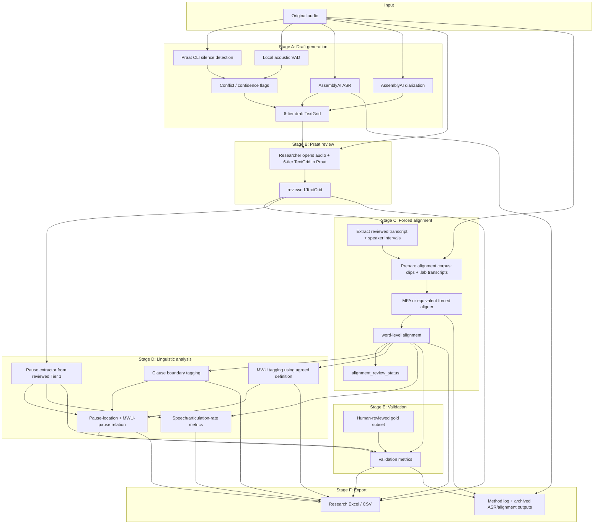

# MVP v2 Architecture: 6-Tier Praat Review + Forced Alignment Analysis Path

版本：v0.1  
日期：2026-06-13  
目标：在现有 6-tier Praat review draft 基础上，把 validated word-level timing / forced alignment 纳入 MVP 主线，支持 pause location、MWU-pause relation、speech/articulation-rate 相关导出和 validation。

## 1. 关键调整

原 MVP v1 的主线是：

```text
audio -> 6-tier draft TextGrid -> Praat review -> reviewed TextGrid -> Excel
```

客户反馈后，MVP v2 的主线应调整为：

```text
audio
  -> 6-tier draft TextGrid
  -> Praat review of pause / speaker / transcript
  -> reviewed TextGrid
  -> forced alignment from reviewed transcript + audio
  -> word / clause / MWU analysis layers
  -> validation report
  -> research Excel
```

重点变化：

- `word-level timing` 不再是 downstream nice-to-have，而是 MVP analysis path 的核心模块。
- `Tier 1 + Tier 4 + Tier 5` 仍然是人工确认的核心输入，但最终 Excel 不再只读取这三层；它还要读取 forced alignment 和 clause/MWU analysis 的结果。
- `pause location` 和 `pause around MWUs` 不能靠 utterance-level transcript 计算，必须依赖 word/clause/MWU alignment。
- `overlap` 当前不能假装已解决；MVP 只做 overlap candidate flag，复杂重叠段进入 manual review / exclusion / later module。

## 2. 总体架构图



## 3. TextGrid / data artifacts

### 3.1 Draft review TextGrid

保持现有 6-tier，用于 Praat 人工确认：

| Tier | 名称 | 生成来源 | 用途 |
| --- | --- | --- | --- |
| 1 | `praat_sounding_silence` | Praat CLI | pause/sounding primary reference |
| 2 | `local_vad_sounding_silence` | Local VAD | second acoustic reference |
| 3 | `sounding_silence_review_status` | rule comparison | T1/T2 mismatch flags |
| 4 | `speaker` | AssemblyAI diarization | speaker draft |
| 5 | `transcript` | AssemblyAI ASR | utterance transcript draft |
| 6 | `review_status` | rule flags | ASR/speaker/confidence review flags |

文件：

```text
audio_name.draft.TextGrid
```

### 3.2 Reviewed TextGrid

研究者在 Praat 中至少确认：

- Tier 1：最终 sounding/silence / pause boundaries。
- Tier 4：speaker ownership。
- Tier 5：verbatim transcript，包括 fillers、repetitions、false starts、repairs。
- Tier 3/6：review flags 是否已经处理。

文件：

```text
audio_name.reviewed.TextGrid
```

### 3.3 Alignment output

forced alignment 不直接覆盖 reviewed TextGrid，而是生成新的 alignment artifact：

```text
audio_name.aligned.TextGrid
audio_name.word_alignment.json
audio_name.alignment-method-log.json
```

建议 alignment TextGrid 增加这些 tier：

| Tier | 名称 | 说明 |
| --- | --- | --- |
| 1 | `reviewed_sounding_silence` | 从 reviewed TextGrid 复制的最终 pause/sounding |
| 2 | `reviewed_speaker` | 从 reviewed TextGrid 复制的 speaker |
| 3 | `reviewed_transcript` | 从 reviewed TextGrid 复制的 transcript |
| 4 | `word` | forced alignment 生成的 word intervals |
| 5 | `clause` | 自动建议或人工确认的 clause boundaries |
| 6 | `mwu` | 按研究者定义标出的 MWU spans |
| 7 | `pause_location` | mid-clause / end-clause / turn-boundary / unknown |
| 8 | `mwu_pause_relation` | before / after / inside / boundary / none / unknown |
| 9 | `alignment_review_status` | alignment low confidence / overlap / OOV / needs review |

## 4. 具体实现模块

### 4.1 Pause threshold and reviewed pause extraction

新增配置：

```json
{
  "silent_pause_threshold_ms": 250,
  "pause_source": "reviewed.TextGrid:tier1",
  "short_silence_policy": "exclude_below_threshold"
}
```

实现逻辑：

1. 读取 `reviewed.TextGrid` 的 Tier 1。
2. 找出所有 `silence` intervals。
3. 只保留 `duration >= 0.25s` 的 silent pauses。
4. 生成 `pause_segments.json`。

输出结构：

```json
{
  "pause_id": "p_0001",
  "start_sec": 12.35,
  "end_sec": 12.82,
  "duration_sec": 0.47,
  "threshold_sec": 0.25,
  "source": "reviewed_tier1"
}
```

### 4.2 Reviewed transcript extraction

输入：

- `reviewed.TextGrid`
- Tier 4 `speaker`
- Tier 5 `transcript`

实现：

1. 解析 transcript intervals。
2. 与 speaker intervals overlap join。
3. 生成可供 alignment 的 `utterance_units.json`。
4. 标记可能的 overlap / unknown speaker。

输出：

```json
{
  "utt_id": "utt_0001",
  "start_sec": 6.45,
  "end_sec": 12.35,
  "speaker": "speaker_A",
  "text": "as it were there are three different stages to the design",
  "reviewed": true,
  "alignment_allowed": true,
  "flags": []
}
```

注意：如果发现两个 speaker intervals 时间重叠，MVP v2 先不强行解决，而是：

- `alignment_allowed = false` 或 `alignment_allowed = partial`
- 写入 `overlap_candidate`
- 进入人工复核或后续重叠语音模块

### 4.3 Alignment corpus preparation

MFA 的最稳 MVP 方式不是把整条 10 分钟混音直接喂进去，而是先切成短 utterance clips。

目录结构：

```text
alignment-work/
  audio_name/
    speaker_A/
      utt_0001.wav
      utt_0001.lab
      utt_0002.wav
      utt_0002.lab
    speaker_B/
      utt_0010.wav
      utt_0010.lab
```

实现步骤：

1. 用 `ffmpeg` 按 reviewed transcript interval 裁剪音频。
2. 每个 clip 生成对应 `.lab` 文本。
3. 文本使用 reviewed transcript，不使用未校正 ASR 文本。
4. 过滤或标记过短、overlap、unknown speaker、空 transcript 的片段。
5. 保留 `clip_offset_sec`，方便把 MFA 的局部时间转回全局时间。

### 4.4 MFA / forced alignment runner

可选实现：

- MVP：Montreal Forced Aligner。
- fallback：如果 MFA 安装复杂，可先抽象成 `ForcedAligner` interface，后端支持 `mfa` provider。

接口建议：

```ts
interface ForcedAligner {
  align(inputDir: string, options: AlignmentOptions): Promise<AlignmentResult>;
}
```

MFA 输出通常包含 TextGrid。系统需要：

1. 读取每个 clip 的 aligned TextGrid。
2. 提取 word intervals。
3. 加上 `clip_offset_sec` 转成原音频全局时间。
4. 合并成 `word_alignment.json`。

输出：

```json
{
  "word_id": "w_000123",
  "utt_id": "utt_0001",
  "speaker": "speaker_A",
  "word": "design",
  "start_sec": 11.92,
  "end_sec": 12.21,
  "alignment_confidence": null,
  "flags": []
}
```

### 4.5 Clause boundary tagging

pause location 需要 clause boundary。实现上可以分两步：

1. 自动建议：
   - 根据 punctuation、conjunctions、finite verbs、pause gaps、ASR punctuation 初稿。
   - 可用简单 rule-based 先做。
2. 人工确认：
   - 输出 `clause` tier 或 Excel sheet。
   - 研究者确认后再进入最终统计。

输出：

```json
{
  "clause_id": "c_0004",
  "speaker": "speaker_A",
  "start_word_id": "w_000101",
  "end_word_id": "w_000118",
  "start_sec": 34.21,
  "end_sec": 38.77,
  "review_status": "auto_suggested"
}
```

### 4.6 MWU tagging

MWU 的定义不能由系统自创，必须由研究者给 operational definition。

实现接口：

```json
{
  "mwu_policy": "researcher_defined",
  "sources": ["paper_or_list_id"],
  "matching_strategy": "lexicon_or_ngram_rules",
  "manual_review_required": true
}
```

MVP 支持两种输入：

1. MWU list：
   - 例如 `you know`, `I mean`, `kind of`
   - 系统按 word sequence 匹配。
2. researcher-reviewed candidate sheet：
   - 系统只导出候选，研究者确认。

输出：

```json
{
  "mwu_id": "mwu_0007",
  "text": "you know",
  "speaker": "speaker_B",
  "start_word_id": "w_000241",
  "end_word_id": "w_000242",
  "start_sec": 82.13,
  "end_sec": 82.48,
  "source": "researcher_list",
  "review_status": "auto_candidate"
}
```

### 4.7 Pause location classifier

输入：

- `pause_segments.json`
- `word_alignment.json`
- `clause_segments.json`

逻辑：

1. 找 pause 前一个 word 和后一个 word。
2. 找前后 word 所在 clause。
3. 如果前后 word 在同一 clause，中间 pause = `mid_clause`。
4. 如果前后 word 在不同 clause，中间 pause = `end_clause`。
5. 如果 pause 在 turn/speaker boundary 附近 = `turn_boundary`。
6. 如果缺少 word/clause 信息 = `unknown`。

输出：

```json
{
  "pause_id": "p_0001",
  "duration_sec": 0.47,
  "previous_word": "design",
  "next_word": "but",
  "previous_clause_id": "c_0002",
  "next_clause_id": "c_0003",
  "pause_location": "end_clause",
  "confidence": "rule_based",
  "review_status": "auto_candidate"
}
```

### 4.8 MWU-pause relation classifier

输入：

- `pause_segments.json`
- `word_alignment.json`
- `mwu_segments.json`

逻辑：

- pause start/end 落在 MWU start/end 之间：`inside_mwu`
- pause 紧贴 MWU 前方，距离小于 window，例如 250ms：`before_mwu`
- pause 紧贴 MWU 后方：`after_mwu`
- pause 与 MWU 边界重合或接近：`mwu_boundary`
- 无关：`none`
- 信息不足：`unknown`

输出：

```json
{
  "pause_id": "p_0002",
  "mwu_id": "mwu_0007",
  "relation": "before_mwu",
  "distance_ms": 120,
  "review_status": "auto_candidate"
}
```

### 4.9 Speech and articulation rate

需要明确口径：

- speech rate: words or syllables / total time including pauses。
- articulation rate: words or syllables / phonation time excluding silent pauses。

MVP 计算两版字段，最终由研究者选定：

```json
{
  "speaker": "speaker_A",
  "window_id": "utt_0001",
  "word_count": 12,
  "syllable_count": 18,
  "total_duration_sec": 5.9,
  "phonation_time_sec": 4.8,
  "speech_rate_words_per_sec": 2.03,
  "articulation_rate_words_per_sec": 2.5,
  "speech_rate_syllables_per_sec": 3.05,
  "articulation_rate_syllables_per_sec": 3.75
}
```

syllable count 可选来源：

1. de Jong & Wempe / Praat syllable nuclei script。
2. dictionary / syllable estimator。
3. forced alignment phone-level output。

MVP 建议先实现 `word_count` 和可插拔 `syllable_counter`，不要在没有校验前承诺最终 syllable metrics。

## 5. Research Excel 输出结构

建议分 sheet：

### 5.1 `Timeline`

一行一个最终 timeline segment：

- file_name
- segment_id
- start_sec
- end_sec
- duration_sec
- reviewed_label
- speaker
- transcript
- review_status

### 5.2 `Pauses`

一行一个 silent pause：

- pause_id
- start_sec
- end_sec
- duration_sec
- threshold_sec
- previous_word
- next_word
- previous_clause_id
- next_clause_id
- pause_location
- speaker_context
- review_status

### 5.3 `Words`

一行一个 aligned word：

- word_id
- utt_id
- speaker
- word
- start_sec
- end_sec
- duration_sec
- alignment_source
- alignment_review_status

### 5.4 `MWUs`

一行一个 MWU：

- mwu_id
- speaker
- mwu_text
- start_word_id
- end_word_id
- start_sec
- end_sec
- source
- review_status

### 5.5 `Pause_MWU`

一行一个 pause 与 MWU 的关系：

- pause_id
- mwu_id
- relation
- distance_ms
- relation_review_status

### 5.6 `Rates`

一行一个 speaker/window/utterance 的 rate 指标：

- speaker
- window_id
- word_count
- syllable_count
- total_duration_sec
- phonation_time_sec
- speech_rate_words_per_sec
- articulation_rate_words_per_sec
- speech_rate_syllables_per_sec
- articulation_rate_syllables_per_sec

### 5.7 `Validation`

- metric
- value
- unit
- gold_subset_id
- notes

## 6. Validation 指标

必须新增：

| 类别 | 指标 |
| --- | --- |
| pause boundary | median boundary error, pause-count error, total pause-duration error |
| pause threshold | 250ms threshold adherence, below-threshold exclusion count |
| transcript | WER 或 manual correction rate |
| speaker | speaker attribution accuracy / correction rate |
| word alignment | word boundary error, alignment failure rate, OOV rate |
| pause location | mid/end/turn-boundary tagging accuracy on gold subset |
| MWU relation | MWU detection precision/recall, pause-MWU relation accuracy |
| flags | T3/T6 flag recall, false-positive rate, edit rate draft-to-final |

## 7. 新增脚本建议

```text
scripts/
  extract-reviewed-units.mjs
  prepare-mfa-corpus.mjs
  run-forced-alignment.mjs
  merge-word-alignments.mjs
  tag-clause-boundaries.mjs
  tag-mwus.mjs
  classify-pause-location.mjs
  classify-mwu-pause-relation.mjs
  export-research-excel.mjs
  validate-against-gold.mjs
```

实现顺序：

1. `extract-reviewed-units.mjs`
2. `prepare-mfa-corpus.mjs`
3. `merge-word-alignments.mjs`
4. `classify-pause-location.mjs`
5. `export-research-excel.mjs`
6. `validate-against-gold.mjs`
7. 再接入真实 MFA runner
8. 最后做 MWU 和 clause review UI / sheet

## 8. MVP v2 边界

MVP v2 应承诺：

- 生成 6-tier draft TextGrid。
- 支持 Praat reviewed TextGrid 导入。
- 从 reviewed transcript 准备 forced alignment 输入。
- 生成 word-level alignment artifact。
- 导出 pause location 和 MWU-pause relation 的候选结果。
- 在 gold subset 上报告 validation metrics。

MVP v2 不应承诺：

- 自动完美处理 overlapping speech。
- 不经人工确认自动判断 clause boundary。
- 不经研究者定义自动决定什么算 MWU。
- 云端 ASR 草稿完全可复现。
- 未验证 alignment 直接作为最终研究真值。
