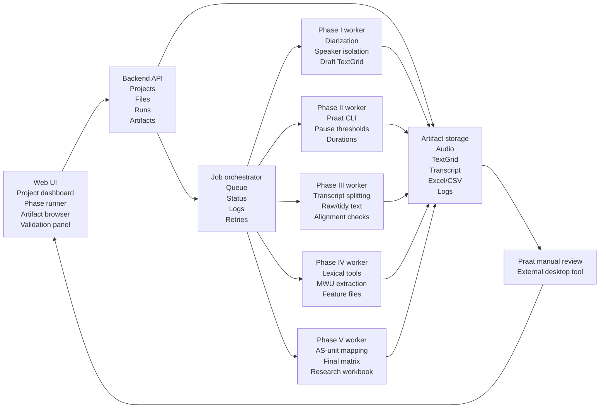

# PRD — AI-Assisted Praat Review Workflow for L2 Dialogic Fluency & Multi-Word Units

**Product:** Five-phase research workflow system for L2 conversational fluency, pause analysis, transcript processing, MWU/lexical feature extraction, and final statistical matrix synthesis
**Version:** 0.5 (draft) - **Date:** 2026-06-21 - **Owner:** Hugo / Luke (development)
**Changelog:** 0.5 - added the Validation Sprint as the Phase 0 benchmark package; aligned delivery tiers to Sprint + L1a/L1b/L2/L3; replaced fixed speaker-count language with configurable speaker count; added Layer 1a/1b implementation readiness; clarified that the Sprint WebUI console is net-new and that the provided workbook has no 0.35 gold baseline. 0.4 - realigned the PRD to Chris's five-phase workflow; added Web UI decision, local-first architecture, phase-runner scope, CLI-first vs Web UI product boundary, and three-stage delivery/pricing map. 0.3 - WP2.1/2.2/2.3/2.5 scaffolds complete: `compute-rate-metrics.mjs`, `tag-clause-boundaries.mjs`, `classify-pause-location.mjs`, `export-research-excel.mjs` (exceljs, 5-sheet workbook). WP2.4 validation harness is pending gold subset from client. 0.2 - Phase 2 expanded into a detailed work-package plan with current implementation status.
**Research stakeholders:** Christopher Hollis (PI of study, Tottori U.) · Jon Clenton (Hiroshima U.) · Daniel Hougham · Gavin Brooks (Python/R scripts + PRAAT annotation supervision — technical counterpart)

---

**Current PRD update (2026-06-21):** Version 0.5 draft realigns the product around Chris's five client-facing phases while adding a paid Validation Sprint before Layer 1. The Web UI is scoped as a local-first workflow console over a reproducible CLI/worker pipeline, not as a replacement for Praat.

## 1. Background & Goal

### 1.1 Research context
The study investigates the relationship between **L2 conversational (dialogic) fluency** and **vocabulary use, specifically multi-word units / lexical bundles (LBs)**, in **multi-party (3-person) English conversation**. It extends the team's prior monologue-based work (Hougham, Clenton & Uchihara, 2024) into **multilogues**.

Per the KAKEN proposal, the central scientific problem is:

> How do the **length and frequency of lexical bundles** affect dialogic fluency across proficiency (CEFR) levels — and can we distinguish **mid-clause dysfluency (to be penalised)** from **end-clause strategic pausing (to be rewarded)**, which current monologue-based rating scales conflate?

### 1.2 Why a tool
Manual Praat annotation is the largest single labour cost in the research (KAKEN budgets RA PRAAT annotation as the top personnel line). The tool's job is to **drastically reduce manual annotation effort while preserving research-grade defensibility** — it produces *reviewable drafts*, not final data.

### 1.3 Product goal
Build a **phase-based, human-verifiable research workflow system** that turns raw multi-party conversation recordings and transcripts into publication-ready analysis artifacts for R/Python. The current target corpus defaults to three speakers, but the product must treat speaker count as a configurable project setting. The system should reduce manual work while preserving the human review, audit trail, and parameter transparency required for peer-reviewed applied linguistics research.

The product must support the full workflow requested by Chris:

- isolate and diarize the configured number of speakers while preserving the original group-audio timeline,
- create Praat-compatible review artifacts and per-speaker muted-mirror WAV files,
- run multi-threshold pause and duration analysis at 0.25 s and 0.35 s thresholds,
- split and clean transcripts into research-specific raw-timing and tidy-phrase versions,
- run or wrap lexical analysis tools including TAALES, TAALED, and AntConc-style MWU extraction,
- synthesize the final dataset with speaker, group, pause, AS-unit, lexical, proficiency, and grade variables,
- retain all raw provider outputs, parameters, method logs, validation results, and human-review status.

The six-tier TextGrid currently implemented in the repository is an important Phase I review artifact, not the whole product goal.

---

## 2. Design Principles (non-negotiable)

1. **Drafts, not truth.** Automatic tools generate preliminary annotations and review flags only. Final analysis rests on TextGrids **reviewed and corrected in the real Praat GUI**.
2. **Human-in-the-loop & defensibility.** The method must survive peer review at a leading journal: explicit parameters, recorded tool versions, archived raw ASR, and gold-subset validation.
3. **Review-before-export operation.** Praat/TextGrid review must happen before research exports are treated as analysis-ready. The Excel/matrix output is generated only after reviewed artifacts are saved, and by default reads only human-confirmed tiers or explicitly approved side-car data.
4. **Dialogue is first-class.** Every temporal measure must distinguish **within-turn**, **between-turn (gap)**, and **turn-boundary** silence. The unit of analysis is the **triad**, not the individual.
5. **Validation is part of the method, not polish.** Each phase has explicit acceptance criteria measured against a human gold subset.
6. **Web UI as orchestration, not annotation replacement.** The application should coordinate files, runs, review gates, configurations, logs, and downloadable artifacts. Praat remains the primary detailed acoustic review environment in v1.

---

## 3. Users & Roles

| Role | Who | Responsibility |
|---|---|---|
| Researcher / annotator | Chris + RAs | Opens audio+TextGrid in Praat, uses flags as a guide, corrects core tiers, saves reviewed file |
| Development | Hugo / Luke | Builds the pipeline, alignment, MWU extraction, exporter, validation harness |
| Technical counterpart | Gavin Brooks | Owns downstream Python/R scripts; supervises PRAAT annotation; sign-off on conventions & Excel schema |
| PI / methodology | Hollis / Clenton | Define operational definitions, approve parameters, consume final data |

---

## 4. System Overview

### 4.0 Web UI Decision and Product Boundary

The Web UI is recommended for the operational product, but it is not required to prove the research method. The project should be built in two layers:

1. **CLI/worker pipeline as the source of truth.** Each phase must be runnable from scripts or workers with stable inputs, outputs, logs, and validation checks. This keeps the method reproducible and suitable for publication.
2. **Thin Web UI workflow console.** The UI should make the pipeline usable by Chris and research assistants: upload source files, run a phase, inspect status, download artifacts, upload reviewed files, and compare validation results.

The UI should not become a browser-based replacement for Praat in v1. Praat is still used for fine acoustic inspection and manual correction of TextGrid boundaries. The product value is reducing setup, batching, file naming, artifact management, and repeated threshold analysis, not eliminating human acoustic review.

Build the first working version as a local-first or lab-internal web app. A public multi-tenant SaaS model should be deferred until consent, data retention, IRB/privacy requirements, API-key handling, and storage policy are clarified.

### 4.0.1 When Web UI Is Necessary

Web UI is justified if the expected users are non-developer researchers or RAs, if multiple recordings must be processed repeatedly, or if Chris expects a controlled phase-by-phase workflow. Chris's updated requirement explicitly describes independent phase execution and validation gates, which maps naturally to a Web UI workflow console.

Web UI is not strictly necessary for algorithm validation. If the immediate goal were only internal feasibility on 2-5 gold-standard samples, CLI scripts plus a documented folder convention would be enough. However, the commercial Validation Sprint should include a small **local WebUI validation console** because it is part of the client-facing trust-building package: upload/select the four benchmark files, configure thresholds, run the sprint modules, view pass/fail comparisons, and download artifacts.

This console is **net-new work**. The existing `src/` frontend is an LDT demo shell, not a ready MWU/Praat validation console. Some UI components and styling patterns can be reused, but pricing and scheduling should treat the Sprint console as a new implementation.

### 4.0.2 Recommended Web UI Scope

The v1 Web UI should provide:

- Project creation and metadata: group id, recording id, expected speakers, cohort labels, notes.
- Audio and transcript upload: source audio, optional AssemblyAI/ASR JSON, optional master transcript, optional manual speaker metadata.
- Phase runner: run Phase I through Phase V independently, with visible status, logs, configuration, and rerun controls.
- Review gates: mark artifacts as draft, needs review, reviewed, rejected, or locked.
- Artifact browser: download WAVs, TextGrids, TXT transcripts, XLSX/CSV matrices, JSON logs, and provider raw outputs.
- Spreadsheet import: upload participant metadata, TOEFL/final oral grades, gold-standard labels, manually generated lexical-tool outputs, and correction tables in XLSX/CSV format.
- Gold-sample validation panel: compare system outputs against agreed gold TextGrid/transcript/result samples before scaling.
- Configuration panel: pause thresholds, expected speaker count, diarization provider, ASR provider, Praat binary path, output naming convention.

The v1 Web UI should not provide:

- Full waveform annotation or manual boundary editing.
- A custom Praat clone.
- Real-time collaborative editing.
- Fully automatic publication-ready outputs without human review.

### 4.0.3 Target Architecture



The backend should expose phase-oriented run endpoints rather than one opaque "process everything" button:

- `POST /projects`
- `POST /projects/{projectId}/files`
- `POST /projects/{projectId}/runs/phase-i`
- `POST /projects/{projectId}/runs/phase-ii`
- `POST /projects/{projectId}/runs/phase-iii`
- `POST /projects/{projectId}/runs/phase-iv`
- `POST /projects/{projectId}/runs/phase-v`
- `GET /runs/{runId}`
- `GET /projects/{projectId}/artifacts`
- `POST /projects/{projectId}/reviewed-artifacts`

### 4.0.4 Implementation Recommendation

Use the existing React/Vite frontend stack and UI component library as the technical base, but build the MWU/Praat validation console as a new product surface. Add a backend API that orchestrates the existing Node scripts and later calls Python workers where needed for pyannote, praatio, WhisperX, or audio processing.

Recommended service split:

- **Frontend:** React/Vite workflow console.
- **Backend API:** Node/Express or Fastify, because the current repository already uses Node scripts and package tooling.
- **Worker layer:** Node for current TextGrid/Excel exports; Python workers only where the tool ecosystem requires it.
- **Queue:** simple local job table for MVP; move to Redis/BullMQ only if parallel processing and retries become important.
- **Storage:** local project folders for MVP, with a manifest JSON per project. Cloud/object storage can be added later.

The architecture should preserve command-line reproducibility. Every Web UI action should map to a scriptable worker command with recorded parameters, input hashes, output paths, and version metadata.

### 4.1 Six-tier TextGrid (Phase I review artifact)
| Tier | Name | Produced by | Status |
|---|---|---|---|
| T1 | `praat_sounding_silence` | Praat CLI acoustic reference; Phase II reports 250 ms and 350 ms threshold outputs | human-confirmed → analysis |
| T2 | `local_vad_sounding_silence` | Local acoustic VAD (second reference) | audit only |
| T3 | `sounding_silence_review_status` | Auto: flags where T1≠T2 | audit only |
| T4 | `speaker` | AssemblyAI diarization draft → reviewed | human-confirmed → analysis |
| T5 | `transcript` | AssemblyAI ASR draft (verbatim) → corrected | human-confirmed → analysis |
| T6 | `review_status` | Auto: flags low confidence / speaker uncertainty / ASR concern | audit only |

> The six-tier TextGrid is the current enhanced Phase I review artifact. Chris's minimum Phase I requirement is a Praat-compatible speaker/timing artifact plus per-speaker muted-mirror audio. Downstream Phase II-V outputs may live as additional TextGrid tiers or side-car data, depending on what Gavin/Chris approve.

### 4.2 Five-phase data flow
```
RAW AUDIO
  -> Phase I: diarization + per-speaker muted-mirror WAV + draft TextGrid
  -> Review gate: verify speaker/timing artifacts in Praat
  -> Phase II: Praat multi-threshold pause/duration analysis (0.25 s + 0.35 s)
  -> Phase III: split master transcript into RAW-TIMING and TIDY-PHRASE text
  -> Phase IV: batch lexical/MWU feature extraction (TAALES/TAALED/AntConc-style)
  -> Phase V: AS-unit pause mapping + final analytic matrix
  -> R/Python mixed-effects models
```

---

## 5. Locked Parameters & Operational Definitions

> These must be confirmed by Chris/Gavin in Phase 0. Defaults below are drawn from the cited literature; the value in **bold** is the project default.

| Parameter | Default | Source / note |
|---|---|---|
| Silent-pause threshold | **250 ms and 350 ms, both reported** | Chris requests simultaneous 0.25 s and 0.35 s analysis. Do not collapse to one threshold unless the research team later signs off. |
| Praat window size | **200 s** | Required by Chris's Phase II description for the Praat macro-style duration analysis. |
| Pause location unit | **AS-Unit** | Foster, Tonkyn & Wigglesworth (2000) |
| Pause location classes | **mid-clause / end-clause / between-turn** | Foster & Tavakoli (2009); +between-turn added for dialogue |
| Pause type | **silent / filled** | filled (uh/um) ≠ pragmatic markers (you know) |
| Speed measure (pure) | **articulation rate = syllables / phonation time** | Tavakoli (2020) |
| Counting unit | **syllables** (not words) | de Jong & Wempe (2009) |
| Syllable detection | **de Jong & Wempe (2009) nuclei method** | required by PI |
| Normalisation denominator | **speaking time (excl. silence)** | Hougham (2025); de Jong (2016b) |
| Short LB | **2–3 words**, text-external, TAALES + COCA spoken, proportion(top 30k)/log-freq/MI | Hougham (2024) |
| Long LB | **4–8 words**, text-internal, AntConc, freq ≥3 & range ≥3 | KAKEN; Biber & Barbieri (2007) |
| LB association threshold | **MI ≥ 3.0** | KAKEN |
| LB refinement | 2× frequency root rule; contractions = 1 word; overlap-merge on shared 3-grams | Wood & Appel (2014); Appel & Wood (2016) |
| Transcript | **verbatim / unpruned** (+ derived cleaned version for n-gram tools) | Tavakoli & Uchihara (2020) |
| Inter-rater reliability target | **Cohen's κ > .85 / Krippendorff α > .80** | KAKEN; BAAL |
| Analysis structure | mixed-effects, **triad & speaker as random effects**, long-format | Uchihara (2026); KAKEN |

---

## 6. Phased Requirements

This PRD now follows Chris's five client-facing phases. The Web UI should expose these as independent run modules with clear review gates, not as one hidden end-to-end automation button.

### 6.0 Phase Relationships

The phases are sequential but not all equally automatic:

1. **Phase I creates the timeline and speaker-specific audio artifacts.** It turns the original group recording into diarization, muted-mirror WAV files, and Praat-compatible draft review files.
2. **Phase II measures acoustic fluency on reviewed speaker tracks.** It depends on Phase I outputs and produces pause/sounding/silence duration artifacts at both 0.25 s and 0.35 s thresholds.
3. **Phase III creates research-ready per-speaker text.** It depends on the master transcript plus Phase I speaker/timing information and produces raw-timing and tidy-phrase transcript versions.
4. **Phase IV extracts lexical and MWU features.** It depends primarily on Phase III text outputs, then runs or wraps TAALES, TAALED, and AntConc-style extraction.
5. **Phase V synthesizes the final analytic database.** It merges Phase II pause data, Phase III text structure, Phase IV lexical features, AS-unit mapping, TOEFL/final oral grades, and participant/group metadata into the final R/Python-ready matrix.

Gold-standard samples and human review gates cut across all phases. The system may automate draft generation, file handling, and calculation, but final research outputs remain human-verified.

### Phase I - Automated Speaker Diarization and Voice Isolation

**Goal:** Convert a raw group recording into speaker-specific artifacts that preserve the original timeline and are ready for Praat review. Speaker count is configurable; the current corpus defaults to 3.

**Scope in**

- Configurable expected speaker count; default 3 for the current corpus, but no code path should assume exactly 3.
- Speaker diarization using a configurable provider such as AssemblyAI, pyannote.audio, WhisperX, or another approved diarization engine.
- Per-speaker muted-mirror WAV generation: the target speaker remains audible; non-target speakers are replaced by silence; total duration and timestamps match the original group audio.
- Initial Praat-compatible TextGrid generation via the existing six-tier pipeline or a research-team-required minimum speaker/timing TextGrid.
- Review flags for low-confidence diarization, overlap, possible speaker confusion, and invalid/unusable regions.

**Scope out**

- Perfect speaker separation in overlapping speech.
- Publication-ready speaker labels without human verification.
- Browser-based acoustic editing.

**Inputs:** original group WAV/MP3, expected speaker count, optional speaker names/metadata, optional existing ASR/diarization JSON.

**Outputs:** diarization JSON, per-speaker muted-mirror WAV files, draft TextGrid, review-status flags, method log.

**Acceptance and validation**

- Output audio files have identical duration and timeline origin as the source recording.
- One muted-mirror track is produced for each expected/confirmed speaker (`N` tracks).
- Non-target speech is silent or marked invalid rather than reassigned to the target speaker.
- Diarization error rate and manual correction rate are reported on gold-standard samples.

### Phase II - Automated Multi-Threshold Pause and Duration Analysis

**Goal:** Run Praat-style sounding/silence analysis on verified isolated speaker tracks and export duration data for both research thresholds.

**Scope in**

- Praat CLI automation, not GUI replacement.
- Simultaneous pause-threshold analysis at **0.25 s and 0.35 s**.
- Praat macro-compatible processing, including the requested **200 s window size** and Praat Scale times behavior.
- TextGrid labels: `sounding`, `silent`, and `invalid`.
- Batch execution of `calculate_segment_durations.praat` or an equivalent reviewed script.

**Scope out**

- Automatic final correction of quiet speech misclassified as silence.
- Replacing the research team's Praat review workflow.

**Inputs:** Phase I muted-mirror WAV files, reviewed or reviewable TextGrid, Praat parameter config, Praat binary path.

**Outputs:** threshold-specific TextGrids per speaker, duration CSV/XLSX files, pause/sounding/silence summaries, Praat run logs.

**Acceptance and validation**

- 0.25 s and 0.35 s outputs are both generated and kept separate.
- Quiet-speech and low-intensity regions are flagged for review instead of silently accepted.
- Duration totals reconcile with source audio duration after invalid regions are accounted for.
- Gold-sample comparison reports pause count error, total pause duration error, and boundary tolerance.

### Phase III - Scripted Transcript Splitting and Alignment

**Goal:** Convert the master group transcript into per-speaker research text files that preserve timing-sensitive fluency phenomena while also supporting lexical/MWU analysis.

**Scope in**

- Split the master transcript by speaker.
- Preserve `X` or agreed placeholder marks for untranscribable words.
- Produce two transcript variants per speaker:
  - `_RAW-TIMING.txt`: keeps fillers, false starts, repetitions, repairs, laughter markers when needed, and timing-relevant material.
  - `_TIDY-PHRASE.txt`: removes non-lexical fillers/laughter and normalizes text for lexical/MWU tools while preserving meaningful repetitions and reformulations.
- Prevent boundary contamination, especially where a speaker's phrase spans a diarization boundary or overlaps another speaker.
- Optional LLM/ASR assistance for draft splitting only; human review remains required.

**Scope out**

- Treating an LLM transcript as a final research transcript.
- Collapsing raw timing text and lexical-clean text into one file.

**Inputs:** master transcript, Phase I speaker/timing data, optional ASR word timestamps, transcription conventions.

**Outputs:** per-speaker raw-timing TXT, per-speaker tidy-phrase TXT, split/alignment table, unresolved-boundary report.

**Acceptance and validation**

- Speaker-specific text reconciles with the master transcript.
- Fillers and repairs are retained in raw-timing files and excluded only where allowed in tidy-phrase files.
- All uncertain speaker boundaries, overlaps, and `X` tokens are surfaced for review.
- Gold-sample transcript split agreement is reported.

### Phase IV - Batch Computational Feature Extraction

**Goal:** Run batch lexical and MWU feature extraction on the Phase III transcript outputs.

**Scope in**

- TAALES 2.2 feature extraction where licensing and local execution allow.
- TAALED lexical diversity extraction.
- AntConc-style four-word lexical bundle/MWU extraction, with an option to use AntConc manually for validation if no reliable headless API is available.
- Tool-specific logs, versions, input file lists, and output normalization.
- Separation of raw timing features and tidy lexical features when required by the research method.

**Scope out**

- Claiming third-party GUI tools have stable APIs unless verified.
- Hiding manual/export steps required by TAALES, TAALED, or AntConc.

**Inputs:** Phase III text files, lexical tool configuration, corpus/reference settings, participant metadata.

**Outputs:** TAALES outputs, TAALED outputs, lexical bundle/MWU tables, normalized lexical feature CSV/XLSX files, tool logs.

**Acceptance and validation**

- Feature rows are traceable to source speaker, group, transcript version, and tool version.
- AntConc-style bundle counts reproduce agreed settings on a gold sample.
- Missing or manually generated third-party outputs are explicitly marked, not inferred.

### Phase V - Structural Database Synthesis and AS-Unit Mapping

**Goal:** Merge acoustic, transcript, lexical, AS-unit, proficiency, and metadata outputs into the final analysis matrix for R/Python.

**Scope in**

- Map pauses into at least these categories: within AS-unit, between AS-units, turn-boundary gap, invalid/excluded.
- Preserve both 0.25 s and 0.35 s pause-threshold variables as separate columns or clearly named feature families.
- Merge lexical/MWU features, fluency/performance measures, participant controls, TOEFL scores, final oral grades, Student_ID, and Group_ID.
- Import researcher-maintained XLSX/CSV sheets for participant metadata, TOEFL/final oral grades, gold-standard validation labels, and manual correction tables.
- Produce a tidy long-format matrix plus speaker/session summary tables.
- Include codebook, method log, validation sheet, and unresolved-data report.

**Scope out**

- Statistical modeling itself unless separately scoped.
- Automatic proficiency scoring or grade prediction.

**Inputs:** Phase II duration/pause outputs, Phase III transcript outputs, Phase IV lexical outputs, AS-unit annotations, participant metadata workbook, TOEFL/final oral grade workbook, optional gold-standard/correction workbooks.

**Outputs:** final research workbook (`.xlsx`), CSV/parquet analysis matrix, data dictionary/codebook, validation report, method log.

**Acceptance and validation**

- Every final row is traceable to source project, group, speaker, transcript version, threshold, and processing run.
- 0.25 s and 0.35 s outputs are both present and distinguishable.
- AS-unit pause mapping agrees with gold labels above the accepted reliability target.
- Final workbook can be consumed directly by R/Python mixed-effects modeling scripts.

### 6.6 Mapping to Current Repository Implementation

The existing six-tier pipeline remains useful, but it should be treated as an implementation component, not the top-level client phase model:

- Existing six-tier TextGrid generation maps mainly to **Phase I**.
- Existing Praat/export scripts map mainly to **Phase II** and part of **Phase V**.
- Existing transcript/alignment scaffolds map to **Phase III** and AS-unit support in **Phase V**.
- Existing `export-research-excel.mjs` maps to the first version of **Phase V**.
- TAALES/TAALED/AntConc wrappers are still needed for **Phase IV**.

### 6.7 Proposed Delivery and Pricing Stages

Chris's Phase I-V define the research workflow. The commercial proposal should separate the **research phases** from the **delivery / pricing layers** so each quote has a clear acceptance gate, dependency boundary, and risk profile.

| Delivery layer | Covers client phase(s) | Purpose | Primary deliverables | Acceptance / dependency boundary |
|---|---|---|---|---|
| **Validation Sprint** | **Phase 0 benchmark + thin Phase II/III/V verification** | Prove the deterministic Praat/TextGrid/Excel calculation chain on the provided monologue sample before pricing the real multilogue pipeline. | Net-new local WebUI validation console; input manifest; gold TextGrid duration replay; 0.25 baseline comparison; 0.35 generated/no-gold output; RAW/TIDY transcript split; matrix skeleton; validation report. | SpeakerX 0.25 baseline must match the provided workbook; 0.35 is generated and preserved but has no workbook gold baseline. This Sprint does **not** validate diarization or speaker isolation. |
| **Layer 1a** | **Phase I** | Process real multilogue recordings into speaker/timing artifacts: diarization, per-speaker muted-mirror audio, and Praat review drafts. | Diarization JSON; `N` muted-mirror WAVs; draft speaker/timing TextGrid; review flags; method log; correction-rate report. | Requires multilogue gold samples for speaker isolation. AI diarization is probabilistic and must be validated separately. |
| **Layer 1b** | **Phase II** | Reuse the verified calculation chain for Praat-compatible dual-threshold pause/duration outputs. | Threshold-specific TextGrids; segment duration tables; 0.25/0.35 outputs; Praat logs; parameter/version logs; review-ready artifacts. | Directly de-risked by the Sprint, but still requires human Praat review for final research data. |
| **Layer 2** | **Phase III + Phase IV + early Phase V** | Add transcript splitting, AS-unit / clause support, lexical and MWU feature extraction, and pause-location metrics after definitions are stable. | `_RAW-TIMING.txt`; `_TIDY-PHRASE.txt`; unresolved-boundary report; lexical/MWU feature tables; pause-location tables; early matrix merge. | Must start only after AS-unit rules, MWU definition, syllable/repair coding conventions, and gold examples are signed off. MFA / word-level alignment is an optional precision add-on, separately quoted and validated. |
| **Layer 3** | **Full Phase V + validation/reporting/UI polish** | Complete the research system: synthesize the final statistical dataset, validate reliability, and polish the UI into a repeatable research workflow. | Final R/Python-ready matrix; final research workbook export; codebook; validation report; reliability/gold-sample reporting; review-status dashboard; full artifact browser; documentation. | Requires stable upstream outputs and signed-off final matrix schema. Statistical modeling and research interpretation remain outside v1 scope unless separately contracted. |

This staging keeps the first paid step small enough to validate feasibility and pricing risk. The Sprint fee may be treated as deductible against Layer 1 only within an agreed window, for example four weeks. Layer 2 should not be quoted as simple "transcription cleanup" because it depends on third-party linguistic tools and research-specific transcript conventions. Layer 3 should be quoted as integration, validation, and systemization rather than as another standalone script.

### 6.8 Layer 1a / 1b Implementation Readiness

This table records what the current repository can and cannot support before development begins. It prevents the proposal from implying that Phase I/II production modules already exist.

| Layer / capability | Current repo status | Evidence / gap | Development implication |
|---|---|---|---|
| Validation Sprint WebUI console | ❌ not built | `src/` is an LDT demo UI; there is no MWU/Praat validation console, project manifest, run controls, or artifact download panel. | Treat as net-new UI work, though existing React/Vite/shadcn-style components can be reused. |
| L1a diarization draft input | 🟡 partial | `assemblyai-json-to-textgrid.mjs` can consume AssemblyAI-style JSON and generate speaker/transcript tiers. | Needs provider run orchestration, configurable speaker count, and raw provider archive. |
| L1a muted-mirror WAV generation | ❌ not built | No script currently produces one full-duration muted-mirror WAV per speaker. | Core Phase I development item. |
| L1a speaker-overlap / uncertainty reporting | 🟡 partial concept only | Six-tier review flags exist, but overlap handling and correction-rate reporting are not productionized for multilogue gold validation. | Needs gold-sample validation harness and explicit overlap metrics. |
| L1b Praat sounding/silence draft | 🟡 partial | `praat-silence-to-textgrid.praat`, `local-acoustic-vad.mjs`, and six-tier TextGrid generation exist. | Needs configurable dual-threshold runner and full-timeline batching. |
| L1b dual 0.25 / 0.35 duration pipeline | ❌ not productionized | Current scripts can compute/export some TextGrid-derived values, but no complete dual-threshold Phase II runner exists. | Core Layer 1b development item. |
| L1b gold replay / baseline comparison | ❌ not built | No current validation-sprint comparator reads the provided SpeakerX workbook and reports pass/fail against the gold values. | First Sprint development item. |
| Phase V research export skeleton | 🟡 partial | `export-research-excel.mjs` and related scaffolds exist, but not aligned to the new client-supplied matrix columns. | Use Sprint to align the matrix skeleton before Layer 2/3 expansion. |

---

## 6A. Legacy/Internal Implementation Notes (superseded as the client-facing phase model)

> Each phase lists: **Goal · Scope (in/out) · Functional requirements · Inputs/Outputs · Acceptance & Validation · Dependencies.**

### Phase 0 — Standards Alignment & Gold Standard (PREREQUISITE)

**Goal:** Lock all conventions against a concrete reference so later phases don't build to the wrong spec.

**Functional requirements**
- F0.1 Obtain **one complete, end-to-end worked reference sample** from the team: raw audio → final corrected TextGrid → word-level alignment (as they'd accept it) → pause-location annotation → MWU segmentation → **final Excel/analysis output**.
- F0.2 If a layer has never been produced (likely word-alignment / MWU), obtain the **conventions** instead; the dev team drafts to those and the team signs off.
- F0.3 Confirm the **§5 parameter table** in writing (with Chris/Gavin).
- F0.4 Confirm the **Excel schema** (the final output format is the binding spec for Phase 3).

**Outputs:** signed-off convention doc; ≥1 closed-loop gold sample; locked parameter table; Excel schema.

**Acceptance:** parameter table and Excel schema explicitly confirmed; at least one gold sample (or a documented agreement on conventions where samples can't yet exist).

**Dependencies:** Chris's data / sample (the email request already sent). **Risk: real corpus not released until mid-July/August 2026** — see §9.

**Validation Sprint mapping:** The client-provided `SpeakerX` monologue package is the first concrete Phase 0 benchmark. It is not a full end-to-end multilogue reference, but it is sufficient to validate the deterministic calculation chain:

- input manifest and file parsing,
- expert TextGrid duration replay,
- SpeakerX 0.25 baseline comparison against the provided Excel workbook,
- 0.35 threshold generation preserved as `generated_no_gold`,
- RAW/TIDY transcript split,
- matrix skeleton and validation report,
- local WebUI validation console for running and inspecting the benchmark.

Workbook inspection confirms that `Example fluency measures calculations SpeakerX.xlsx` contains `Durations` and `Fluency measures` sheets with Example/Speaker columns, not separate 0.35 threshold baseline columns. Numeric values near `0.35` inside the workbook are individual pause durations, not 0.35-threshold gold variables.

---

### Phase 1 — Six-Tier TextGrid + Praat Review + Baseline Fluency Excel (the MVP demo)

**Goal:** Convert audio into a reviewable 6-tier draft and export baseline fluency measures after human review. This is the "small MVP demo" promised at the 2026-06-12 meeting.

**Scope — in:** T1–T6 generation; two-stage review→export; within-turn vs between-turn silence distinction; baseline speed/breakdown/repair export.
**Scope — out:** word-level alignment, mid/end-clause classification, MWU (Phases 2–3).

**Functional requirements**
- F1.1 **T1 Praat sounding/silence** via Praat CLI, silent-pause threshold **250 ms**, parameters recorded.
- F1.2 **T2 local VAD** as an independent acoustic reference.
- F1.3 **T3 disagreement flag** marking regions where T1≠T2 (tolerance configurable).
- F1.4 **T4 speaker** from AssemblyAI diarization using the configured expected speaker count; raw output archived.
- F1.5 **T5 verbatim transcript** from AssemblyAI: preserve fillers, repetitions, false starts, repairs; never auto-clean.
- F1.6 **T6 review flag**: low ASR confidence, speaker uncertainty, overlap regions.
- F1.7 **Two-stage operation**: generate draft → researcher reviews/corrects T1/T4/T5 in Praat GUI → save → export.
- F1.8 **Dialogue silence typing**: classify each silence as within-turn vs between-turn (gap) using T1×T4; do **not** force-attribute between-turn gaps in multi-party audio — flag and retain raw turn boundaries for sensitivity analysis.
- F1.9 **Excel export (baseline)**: per speaker × (per turn + per session), speed/breakdown/repair measures; absolute counts + normalised (per min speaking time / per 100 syllables); dual-report metrics sensitive to between-turn handling (incl./excl.).
- F1.10 **Method log**: Praat version, silence params, VAD params, AssemblyAI params + raw-output date, script version.

**Inputs:** raw audio (WAV ≥16 kHz mono per channel; ideally per-speaker channels).
**Outputs:** 6-tier draft TextGrid; reviewed TextGrid; baseline Excel; method log; archived raw ASR.

**Acceptance & Validation (vs gold subset)**
- Boundary agreement (T1 draft vs human) within tolerance (e.g. ±X ms) reported.
- Pause-count error and total pause-duration error reported.
- Transcript WER / manual correction rate reported.
- T3/T6 flag **recall**: do flags catch the regions humans later correct?
- Edit-rate from draft → final reported.

**Dependencies:** Phase 0. AssemblyAI English-only (confirmed at meeting).

---

### Phase 2 — Word-Level Alignment + Pause-Location (email "Phase 2")

**Goal:** Make pause *location* real by adding validated word-level timing and clause segmentation. Pulled into the MVP path at Jon's explicit request (not a downstream module).

**Scope — in:** forced alignment; AS-Unit/clause segmentation; mid/end-clause + between-turn pause classification; syllable-nuclei articulation rate.
**Scope — out:** MWU extraction (Phase 3).

#### Current implementation status (2026-06-15)

The forced-alignment *spine* exists and has been run end-to-end; the *linguistic* layers on top of it do not exist yet.

| Capability | Status | Evidence / gap |
|---|---|---|
| Reviewed-unit extraction → MFA corpus prep | ✅ done | `extract-reviewed-units.mjs`, `prepare-mfa-corpus.mjs` (ffmpeg clips + `.lab`) |
| Forced alignment (MFA 3.3.9) + global-time merge | ✅ done | `run-forced-alignment.mjs`, `merge-mfa-word-alignments.mjs` → `word_alignment.json` (315 words on elllo sample) |
| Pause extraction @ 250 ms + nearest-word context | ✅ done | `extract-pause-segments.mjs` (35 pauses on elllo) |
| Pause-location classification | 🟡 candidate-only | 26/35 stuck at `word_gap_requires_clause_boundary`; no `mid/end-clause` because no clause tier |
| **AS-Unit / clause segmentation** | ❌ not started | no `tag-clause-boundaries` script; researcher AS-unit transcripts still TBA |
| **Syllable nuclei + articulation/speech rate** | ❌ not started | no nuclei script in repo; de Jong & Wempe (2009) script not yet obtained (R3) |
| **Mid/end-clause + between-turn final labels** | ❌ not started | depends on clause tier |
| Filled-pause vs pragmatic-marker tagging | ❌ not started | needed for breakdown-vs-resource split + Phase 3 |
| Alignment QC (confidence / OOV) | ✅ done (WP2.0) | `merge-mfa-word-alignments.mjs` now reads `alignment_analysis.csv`, attaches per-word `alignment_confidence`/`alignment_flags`/`oov`, emits per-speaker `*_alignment_review_status` tier; flags `missing_alignment` / `unscored` / `low_confidence` / `oov_or_unaligned` |
| Alignment QC (WhisperX comparison) | ❌ not started | second aligner for gold-subset comparison (R8) still to do |
| Validation vs gold subset | ❌ not started | no `validate-against-gold` script; gold subset not yet supplied |
| Repo/integration hygiene | 🟡 mostly fixed (WP2.0) | `LDTWeb/Ldtwebdemo` paths removed from `.praat` helpers; chain re-runs in MWU (`outputs/wp2.0/`). **Residual (human):** reviewed input is still **simulated** — needs one real Praat-reviewed file |

#### Functional requirements (with status)

- F2.1 ✅ **Forced alignment** (MFA primary; WhisperX as comparison — comparison still ❌) producing word-level timestamps from reviewed T5; rough output is acceptable then checked in Praat.
- F2.2 ❌ **Syllable nuclei detection** (de Jong & Wempe, 2009) → articulation rate, mean syllable duration.
- F2.3 ❌ **AS-Unit / clause segmentation** of the transcript (semi-automatic; human-reviewable).
- F2.4 🟡 **Pause-location classification**: each silent pause (≥250 ms) tagged **mid-clause / end-clause / between-turn**, combining alignment + clause + turn tiers. *(Word-gap and turn-boundary candidates exist; mid/end-clause blocked on F2.3.)*
- F2.5 ❌ **Filled-pause & pragmatic-marker tagging** kept distinct (uh/um vs you know/I mean).
- F2.6 ❌ Surface alignment-confidence flags for review.

#### Detailed advancement plan (work packages)

Sequencing: **WP2.0 → (WP2.1 ∥ WP2.2) → WP2.3 → WP2.4 → WP2.5**. WP2.1 (rates) and WP2.2 (clauses) are independent and can run in parallel. Effort sizes are indicative (S ≈ ≤2 d, M ≈ 3–5 d, L ≈ 1–2 wk dev).

| WP | Deliverable | New/changed artifacts | Acceptance | Depends on | Effort |
|---|---|---|---|---|---|
| **WP2.0 Alignment consolidation & QC** — ✅ **done** (engineering); residual = real Praat review | Port pipeline into MWU repo; fix `LDTWeb` paths; re-run on sample; add `alignment_confidence`, OOV list, `alignment_review_status` tier; surface low-confidence words. Replace simulated reviewed input with **one real Praat-reviewed file**. | ✅ `merge-mfa-word-alignments.mjs` gains `--alignment-analysis-csv` / `--min-overall-log-likelihood` / `--max-phone-duration-deviation`, per-word `alignment_confidence`/`alignment_flags`/`oov`, `alignment_review[]`, `summary.alignment_qc`, and per-speaker `*_alignment_review_status` tiers. ✅ `.praat` helpers de-LDTWeb'd. ✅ Re-ran C→D in MWU (`outputs/wp2.0/elllo`, 315 words). ⏳ **Residual (human):** one real Praat-reviewed TextGrid to replace the simulated input. | Pipeline runs in MWU; QC flags populated (verified: `missing_alignment` on AMI, `low_confidence` via threshold) | Phase 1 reviewed output | M |
| **WP2.1 Syllable nuclei + rate metrics** — ✅ **scaffold done** | Integrate de Jong & Wempe (2009) nuclei detection; compute per utterance/speaker/session: syllable count, phonation time (from reviewed T1 sounding), **articulation rate = syll/phonation**, speech rate = syll/total, MLR, phonation-time ratio. Normalise on **speaking time (excl. silence)**. | ✅ `compute-rate-metrics.mjs` → `rate_metrics.json` (session + per-speaker + per-utterance; elllo: artic=4.064 syl/s, PTR=0.858, 315 words). Syllable source pluggable: `heuristic` (default provisional) / `nuclei-csv` (swap in de Jong & Wempe output) / `none`. Per-speaker breakdown (Todd/Simon/…). | Syllable-count agreement vs human Praat counts on gold | de Jong & Wempe script (R3, swap-in ready); WP2.0 | M (blocked on script) |
| **WP2.2 AS-Unit / clause segmentation** — ✅ **Path B scaffold done** | **Path A (primary):** ingest researcher-supplied AS-unit transcripts (blank-line-separated, per HOLLIS directions Step 3) and map AS-units onto the word alignment. **Path B (assist):** rule-based boundary suggestion (ASR punctuation, conjunctions, finite verbs, ≥X ms pauses) for files lacking manual AS-units → human-confirmable. | ✅ `tag-clause-boundaries.mjs` → `clause_segments.json`. Path B implemented: speaker-change / long-gap (default 0.4 s) / clause-initial conjunctions (17-word default list, fully overridable via `--conjunctions`). elllo: 315 words → 61 clauses, mean 5.16 words. Path A (`--as-unit-file`) reserved; throws NotImplemented (files TBA). | Clause-boundary agreement vs human AS-unit files on gold | Researcher AS-unit transcripts **or** approval of auto-suggest; WP2.0 | L |
| **WP2.3 Mid/end-clause + between-turn classification** — ✅ **scaffold done** | Upgrade pause classifier to consume `clause_segments` + word alignment + speaker turns: same clause→`mid_clause`, different clause→`end_clause`, speaker change→`between_turn`, missing info→`unknown`. Also tag **filled pause vs pragmatic marker** on the word tier. Replace candidate flags with final labels + confidence. | ✅ `classify-pause-location.mjs` → `pause_location.json`. elllo: 35 pauses → mid_clause:1, end_clause:25, between_turn:7, leading_pause:1. All rows `review_status="auto_candidate"`. `review_note` warns when clause source is `rule_suggested`. | **Pause-location κ vs human > .85** (Jon's requirement) | WP2.1/WP2.2 | M |
| **WP2.4 Validation harness** | `validate-against-gold.mjs`: word-boundary error (% within ±X ms), syllable-count agreement, pause-location κ, draft→final edit rate. | `validation_report.json`; `Validation` sheet; entries in method log | Reports produced on gold subset; thresholds met or documented | Gold subset (Phase 0); WP2.1–2.3 | M |
| **WP2.5 Export integration** — ✅ **done** | Extend research Excel with `Words`, `Clauses`, `Rates`, `Pauses` (with location) sheets + `Summary`. Replace proprietary `@oai/artifact-tool` with exceljs. | ✅ `export-research-excel.mjs` → `<recording>.research.xlsx`. 5 sheets: Words (315 rows, alignment confidence), Clauses (61), Pauses (35, with location labels), Rates (session + per-speaker + per-utterance), Summary (provenance + QC stats). `exceljs` added as devDependency; no proprietary runtime. | Workbook opens with all sheets, no proprietary dependency | WP2.1–2.3 (WP2.4 adds Validation sheet later) | S–M |

**Inputs:** reviewed Phase-1 TextGrid + audio; (WP2.2) researcher AS-unit-segmented transcripts; (WP2.1) de Jong & Wempe nuclei script; (WP2.4) gold subset.
**Outputs:** word-aligned tier(s) + alignment QC; AS-Unit/clause tier; mid/end-clause/between-turn pause labels; articulation/speech-rate metrics; validation report; extended research Excel.

**Acceptance & Validation (vs gold subset) — Jon's explicit requirement**
- **Word-level alignment accuracy** on the gold subset (e.g. % word boundaries within ±X ms of human).
- Syllable-count agreement vs human Praat counts.
- Pause-location classification agreement (κ) vs human (target > .85).

**Blocking external dependencies — request from Chris/Gavin now**
1. **Gold subset** for ≥1–2 files: human-verified word boundaries + AS-unit-segmented transcripts + human mid/end-clause labels.
2. **de Jong & Wempe (2009)** syllable-nuclei Praat script (or written approval to reimplement) — see R3.
3. **Clause decision:** is rule-based auto-suggest acceptable, or are manual AS-unit transcripts mandatory for every file?
4. **Sign-off on tolerances:** ±X ms word-boundary tolerance and the κ target for pause-location.

**Dependencies:** Phase 1 reviewed output; gold subset with human-verified word boundaries (Phase 0).

---

### Phase 3 — MWU Analysis (email "Phase 3")

**Goal:** Extract MWUs/LBs, align them to the timeline, and compute the study's core construct — **where pauses fall relative to MWUs**.

**Scope — in:** LB extraction (short + long), MWU layer aligned to transcript/timing, pause↔MWU positional analysis, full long-format analytic export.
**Scope — out:** automatic CEFR scoring; rating-scale validation (research workstream, not the tool).

**Functional requirements**
- F3.1 **Short LB (2–3 words)** — text-external via TAALES against COCA spoken; metrics: proportion (top 30k), log-frequency, MI.
- F3.2 **Long LB (4–8 words)** — text-internal via AntConc; threshold freq ≥3 & range ≥3; **Wood & Appel (2014) refinement** (2× root rule, contractions = 1 word, overlap-merge); MI via Collocate.
- F3.3 **Dual transcript handling**: verbatim for fluency; cleaned (no uh/um, spelling fixed) for n-gram tools.
- F3.4 **MWU layer** aligned to word timestamps (each MWU instance: surface text, length, MI/frequency, overlap/nesting flag, source TAALES/AntConc/manual).
- F3.5 **Pause↔MWU positional mapping** (core novel output): for each pause, classify whether it falls **inside / before / after** an MWU, using Phase-2 word alignment.
- F3.6 **Mark task/prompt-borrowed sequences** to control the text-mining confound.
- F3.7 **Analytic Excel export (long-format / tidy)** at event-, turn-, MWU-instance-, and speaker/session-summary granularity, carrying: speaker_id, triad_id, turn_id, CEFR, L1, timestamps, event type, pause-location, pause-type, MWU (length/MI/freq/overlap), articulation rate, repair counts — ready for mixed-effects models with triad/speaker random effects.

**Inputs:** Phase-2 aligned TextGrid + cleaned transcript.
**Outputs:** MWU layer; pause↔MWU table; final long-format analytic Excel.

**Acceptance & Validation**
- MWU segmentation agreement vs human/reference.
- Reproduce Hougham-style LB metrics on a known sample (sanity check).
- Report coverage: % of n-grams scorable against COCA; % conversation-specific sequences excluded.

**Dependencies:** Phase 2 alignment; MWU conventions confirmed (Phase 0).

---

## 7. Data Specifications

### 7.1 Artifact layout (target)
Confirm with Gavin whether derived layers are Praat tiers or side-car. The system should preserve all of the following artifact families:

1. source audio and normalized audio,
2. Phase I diarization JSON and per-speaker muted-mirror WAV files,
3. Phase I review TextGrid, including the current six-tier enhanced schema where useful,
4. Phase II threshold-specific TextGrids and duration tables for both 0.25 s and 0.35 s,
5. Phase III per-speaker `_RAW-TIMING.txt` and `_TIDY-PHRASE.txt` files,
6. Phase IV TAALES, TAALED, and AntConc-style lexical/MWU outputs,
7. Phase V AS-unit mapping, pause-location mapping, final analytic matrix, codebook, and validation report.

Target annotation concepts include: transcript, speaker/turn, sounding/silence, invalid region, pause duration, pause threshold, AS-unit/clause boundary, MWU/LB span, syllable/rate metrics, and audit/review status.

### 7.2 Final matrix schema (binding spec - confirm in Phase 0)
Long-format, one observation per row, examples of granularity: pause-event, repair-event, MWU-instance, AS-unit, turn, speaker-session.

Required columns include:

- identifiers: `Student_ID`, `Group_ID`, `speaker_id`, `turn_id`, `task_id`, `recording_id`, `run_id`,
- metadata/control variables: CEFR, L1, gender, study-abroad, TOEFL score, final oral grade,
- pause variables: threshold family (`0.25s` or `0.35s`), pause duration, sounding duration, invalid duration, within-AS-unit, between-AS-units, turn-boundary gap, invalid/excluded,
- fluency/performance variables: articulation rate, speech rate, phonation time, repair counts, filled pause counts, speaking time,
- transcript variables: raw/tidy transcript source, `X` count, unresolved-boundary flags,
- lexical/MWU variables: TAALES metrics, TAALED metrics, bundle length, MI/frequency/range, overlap/nesting, AntConc-style source, pause-relative position,
- QC variables: review status, double-coded flag, gold-sample result, alignment accuracy, tool versions, parameter set.

### 7.3 Spreadsheet Import/Export Requirements

Excel/CSV import and export remain part of the product. The Web UI should treat spreadsheets as controlled research artifacts, not as ad hoc uploads.

**Import requirements**

- Import `.xlsx` and `.csv` files for participant metadata, TOEFL/final oral grades, gold-standard labels, manually corrected tables, and third-party lexical-tool outputs.
- Validate required columns before accepting a file. At minimum, imported research metadata must be linkable by `Student_ID`, `Group_ID`, `speaker_id`, and/or `recording_id`.
- Preserve the original uploaded spreadsheet as an artifact and create a normalized JSON/CSV representation for downstream workers.
- Show schema errors, unmatched IDs, duplicate keys, missing scores, and type mismatches in the Web UI.
- Never overwrite generated data silently; imported corrections should be versioned and traceable to the upload time and user.

**Export requirements**

- Export Phase II duration/pause results as `.xlsx` and `.csv`, with separate columns or sheets for 0.25 s and 0.35 s threshold outputs.
- Export Phase IV normalized lexical/MWU feature tables as `.xlsx` and `.csv` where practical.
- Export Phase V as the final research workbook (`.xlsx`) plus machine-readable `.csv` or parquet files for R/Python.
- Include workbook sheets for Summary/Provenance, Pauses, Rates, Transcripts or Clauses/AS-units, Lexical/MWU features, Validation, and unresolved issues when available.
- Every exported workbook must include run parameters, tool versions, source artifact references, and review status.

---

## 8. Validation & Method Log (cross-cutting)

- **Gold subset** is the calibration anchor for every phase: speaker diarization, muted-mirror audio, Praat pause analysis, transcript splitting, lexical/MWU extraction, AS-unit mapping, and final matrix synthesis.
- **Double-coding**: 20% of data independently annotated; report κ/α (targets in §5).
- **Method log** (per file/run): Praat version, threshold set, window size, VAD/diarization params, AssemblyAI/ASR params, lexical tool versions, script version, raw provider output date, gold-subset validation results, and manual-review requirements.
- **Archive** raw cloud ASR output (exact regeneration not guaranteed).

---

## 9. Risks & Open Questions

| # | Risk / question | Impact | Mitigation |
|---|---|---|---|
| R1 | Real corpus not released until mid-July/August 2026; Sept conference deadline | Squeezes Phase I-V validation and scaling | Use prior-study/gold samples now; pipeline ready before data lands |
| R2 | Complete gold sample across all five phases may not exist yet | Blocks full validation | Fallback: confirm conventions, dev drafts, team signs off per phase |
| R3 | Missing source papers: de Jong & Wempe (2009); "Facets of Fluency" | 250 ms / syllable-rate provenance | Request from Chris |
| R4 | Pause threshold conflict (250 vs 350 ms) | Method consistency | Generate and preserve both 0.25 s and 0.35 s outputs until the research team decides otherwise |
| R5 | Dialogue between-turn pause attribution in multi-party audio | Metric validity | Flag, don't force-attribute; dual-report |
| R6 | Group alignment effect (MWU variance driven by triad) | Misreading individual ability | Triad as random effect; report ICC |
| R7 | MI reliability for sequences >2 words | LB metric validity | Note as limitation; cross-check methods |
| R8 | MFA vs WhisperX accuracy on overlapping/accented L2 speech | Alignment quality | Compare both on gold subset (F2.1) |
| R9 | TAALES/TAALED/AntConc may require manual or desktop execution rather than stable APIs | Phase IV automation risk | Build wrappers around file conventions first; mark manual steps explicitly; validate outputs against gold samples |

---

## 10. Milestones (indicative)

| Milestone | Pricing stage | Target | Gate |
|---|---|---|---|
| M0 Validation Sprint benchmark | Validation Sprint | current SpeakerX monologue sample | local WebUI console; 0.25 SpeakerX workbook baseline matched; 0.35 marked generated/no-gold; validation report produced |
| M1 Phase I speaker isolation demo | Layer 1a | first multilogue gold sample | `N` muted-mirror WAVs + draft TextGrid + diarization correction/error report |
| M2 Phase II pause/duration demo | Layer 1b | after M1 reviewed artifacts, or monologue input for calculation-only tests | 0.25 s and 0.35 s Praat-compatible outputs + duration workbook |
| M3 Phase III transcript split demo | Layer 2 | after master transcript sample and transcript conventions sign-off | RAW-TIMING and TIDY-PHRASE files per speaker |
| M4 Phase IV lexical feature demo | Layer 2 | after MWU / AS-unit / syllable / repair definitions sign-off | TAALES/TAALED/AntConc-style outputs normalized; pause-location assumptions documented |
| M5 Phase V final matrix demo | Layer 3 | aligned with corpus release (Jul-Aug) | R/Python-ready matrix with AS-unit pause mapping |
| M6 Validation report | Layer 3 | before Sept conference | gold-subset results documented across all contracted layers |

---

## 11. Out of Scope (v1)

- Automatic CEFR / proficiency scoring.
- IELTS/TOEFL rating-scale development & MFRM validation (research workstream).
- Robust overlapping-speech separation beyond flagging.
- Cross-linguistic (Vietnamese/Spanish) extension (data field kept extensible only).
- Browser-based Praat replacement, waveform editor, or manual boundary annotation tool.
- Public multi-tenant SaaS deployment before IRB/privacy, data retention, consent, and API-key policy are agreed.
- One-click publication-ready automation without human review gates.

---

### Appendix A — Reference papers underpinning each requirement
See `文献对照表-Literature-Comparison.md` for the full per-paper mapping. Key anchors: Tavakoli & Wright (2020, measures), de Jong & Wempe (2009, syllables), Foster et al. (2000, AS-Unit), de Jong & Bosker (2013, 250 ms), Tavakoli (2016, dialogue), Hougham et al. (2024 ×2, LB length), Uchihara et al. (2026, dialogue MWS null + triad effect), Takizawa & Suzuki (2025, mid-clause), KAKEN/BAAL (requirements).
