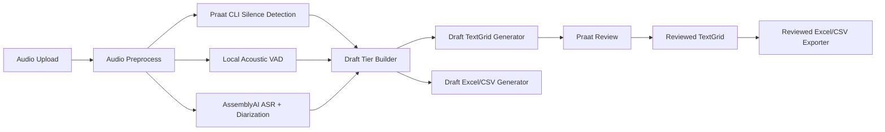
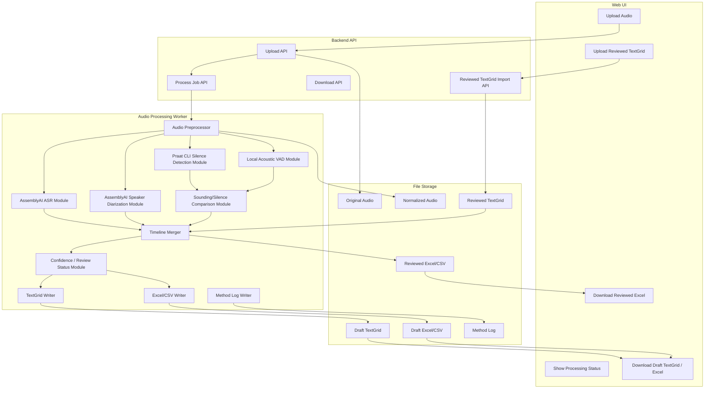
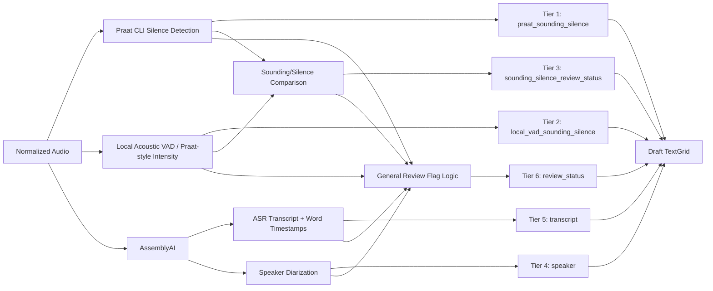
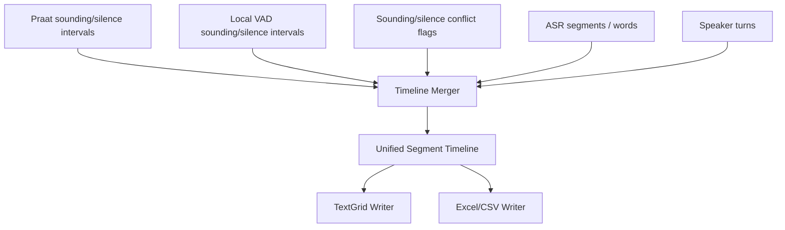

# 6-Tier Review TextGrid Generation Module Diagram

版本：v0.3  
日期：2026-06-13  
目标：用 Praat CLI 和 Local VAD 分别生成两条 pause/sounding 参考层，用 AssemblyAI 生成 transcript/speaker 草稿，自动标出参考层冲突，合成为 Praat 可校验的 6-tier review TextGrid，并支持 Chris 校验后导出 Excel/CSV。

## 1. 总体流程



一句话解释：

Web UI 只负责上传和下载；后台负责生成 6-tier draft/review TextGrid 和 draft Excel；Chris 在 Praat 里确认后，再从 reviewed TextGrid 导出最终 Excel。Praat 自动层和 Local VAD 自动层都是参考，不是最终真值。最终 pause/silence 研究数据只来自 Chris reviewed TextGrid。

## 2. 后台模块图



## 3. 6 个 Tier 的生成来源



Tier 设计：

| Tier | 来源模块 | 作用 |
| --- | --- | --- |
| `praat_sounding_silence` | Praat CLI silence detection | Praat 自己生成的 sounding/silence 参考层 |
| `local_vad_sounding_silence` | Local acoustic VAD / Praat-style intensity detection | 我们本地算法生成的 sounding/silence 参考层 |
| `sounding_silence_review_status` | Rule-based comparison | 标记 Tier 1 和 Tier 2 不一致、边界差异过大、需要 Chris 检查的区间 |
| `speaker` | AssemblyAI speaker diarization | 标记 speaker_1 / speaker_2 / speaker_3 / overlap / unknown |
| `transcript` | AssemblyAI ASR | 标记英文转写文本；word timestamps 只辅助草稿定位，不作为最终 word timing |
| `review_status` | Confidence / rules / human review | 标记 ASR 低置信度、speaker 不确定、重叠、边界冲突、pending / confirmed / fixed / exclude |

AssemblyAI 的职责边界：

| AssemblyAI 输出 | 用在哪里 | 不能用在哪里 |
| --- | --- | --- |
| `utterances[].text` | `transcript` tier 初稿、Excel transcript | 不能作为最终研究 transcript，需 Chris 校验 |
| `utterances[].speaker` | `speaker` tier 初稿 | 不能静默解决重叠或不确定 speaker |
| `words[].start/end` | 帮助把 transcript 分配到时间轴、辅助 forced alignment 对照 | 不能生成最终 `sounding/silence` pause 边界，也不能作为最终 word timing |
| `confidence` | `review_status` 的 `pending:*` flag | 不能替代人工判断 |

`praat_sounding_silence` / `local_vad_sounding_silence` 的职责边界：

- 两层都输出 `sounding` / `silence` interval。
- `praat_sounding_silence` 是 Praat 自动参考。
- `local_vad_sounding_silence` 是本地算法参考。
- 二者不一致时必须标入 `sounding_silence_review_status`。
- 最终 pause metrics 只能从 Chris-reviewed TextGrid 读取，不能直接取任一自动参考层。

## 4. Timeline Merger 的职责

Praat 自动层、Local VAD、ASR、speaker diarization 的输出时间边界不会天然一致，所以需要一个 Timeline Merger。



Timeline Merger 输出统一结构：

```json
{
  "segment_id": "seg_0001",
  "start_time": 1.72,
  "end_time": 2.36,
  "duration": 0.64,
  "praat_sounding_label": "sounding",
  "local_vad_sounding_label": "silence",
  "sounding_silence_review_status": "pending: praat_local_vad_mismatch",
  "speaker": "speaker_1",
  "transcript": "so what we need to do is",
  "confidence": {
    "vad": 0.91,
    "asr": 0.84,
    "speaker": 0.72
  },
  "review_status": "pending: low_confidence"
}
```

## 5. TextGrid Writer 输出结构

TextGrid Writer 将统一 timeline 写成 Praat 可打开的 TextGrid：

```text
Review TextGrid
  Tier 1: praat_sounding_silence
    0.00 - 1.72 silence
    1.72 - 2.36 sounding

  Tier 2: local_vad_sounding_silence
    0.00 - 1.80 silence
    1.80 - 2.36 sounding

  Tier 3: sounding_silence_review_status
    1.72 - 1.80 "pending: praat_local_vad_mismatch"

  Tier 4: speaker
    1.72 - 2.36 speaker_1

  Tier 5: transcript
    1.72 - 2.36 "so what we need to do is"

  Tier 6: review_status
    1.72 - 2.36 "pending: low_confidence"
```

MVP 文件名：

```text
{audio_name}.draft.TextGrid
```

Chris 校验后文件名：

```text
{audio_name}.reviewed.TextGrid
```

Reviewed TextGrid 仍然可以保留 6 个 tier 作为审计痕迹；最终研究导出时只读取 Chris 确认后的层和状态，不把自动参考层直接当作最终结果。

## 6. Excel/CSV Exporter 输出逻辑

Draft Excel 可以从同一份 unified timeline 生成：


Reviewed Excel 应该从 Chris 保存后的 reviewed TextGrid 重新导出：


推荐 reviewed Excel 以 Chris-reviewed TextGrid 的最终 timeline 为准，保留 `sounding` 和 `silence`。`sounding` 行补充 speaker/transcript/review_status；`silence` 行保留时长用于 pause 统计。自动参考层和冲突层可以导出到 audit 字段，但不能作为最终 pause 指标来源。

| 字段 | 来源 |
| --- | --- |
| `segment_id` | exporter 生成 |
| `start_time` | TextGrid interval xmin |
| `end_time` | TextGrid interval xmax |
| `duration_seconds` | end_time - start_time |
| `segment_type` | Chris-reviewed sounding/silence tier |
| `speaker` | speaker tier |
| `transcript` | transcript tier |
| `review_status` | review_status tier |
| `praat_ref_label` | praat_sounding_silence tier，可选 audit 字段 |
| `local_vad_ref_label` | local_vad_sounding_silence tier，可选 audit 字段 |
| `sounding_silence_review_status` | sounding_silence_review_status tier，可选 audit 字段 |
| `human_reviewed` | 从 review_status 判断 |
| `notes` | 可选人工备注 |

## 7. 第一批开发模块顺序

建议按这个顺序实现：

1. Audio upload + local storage
2. Audio preprocess: normalize to 16kHz mono WAV
3. Praat CLI silence detection -> `praat_sounding_silence`
4. Local acoustic VAD -> `local_vad_sounding_silence`
5. Sounding/silence comparison -> `sounding_silence_review_status`
6. TextGrid Writer v1
7. Praat open test
8. ASR -> `transcript`
9. AssemblyAI speaker diarization -> `speaker`
10. General review status rules -> `review_status`
11. Draft Excel/CSV export
12. Reviewed TextGrid -> reviewed Excel/CSV export

## 8. MVP 最小可交付

第一版可以分两步：

### MVP-A: 验证 Praat 链路

- 上传 audio。
- 生成 `praat_sounding_silence`。
- 生成 `local_vad_sounding_silence`。
- 生成 `sounding_silence_review_status`。
- 导出 draft TextGrid。
- Praat 能打开并校验边界。

### MVP-B: 完整 6-tier 草稿

- 生成 `praat_sounding_silence`。
- 生成 `local_vad_sounding_silence`。
- 生成 `sounding_silence_review_status`。
- 生成 `speaker`。
- 生成 `transcript`。
- 生成 `review_status`。
- 导出 draft TextGrid。
- 导出 draft Excel/CSV。
- Chris 校验 reviewed TextGrid。
- 从 reviewed TextGrid 导出 reviewed Excel/CSV。
