# MWU system design

**Version:** 1.0  
**Status:** Approved target design with current-code mapping

## 1. Design intent

The architecture separates probabilistic evidence, deterministic transformation and researcher
confirmation. It does not ask one AI service to manufacture the complete research dataset.

```mermaid
flowchart LR
  WAV[Canonical room-mix WAV] --> A[L1a evidence generation]
  A --> B[Candidate listening and researcher mapping]
  B --> C[Accepted S1-SN Phase I handoff]
  C --> D[L1b acoustic and interaction engine]
  D --> E[Dynamic N+3 TextGrid drafts]
  E --> F[Local Praat review and save]
  F --> G[L2 reviewed TextGrid upload and analysis]
  G --> H[L3 matrix, reporting and archive]
```



## 2. Architectural principles

1. The WAV is the master clock.
2. AI providers supply evidence; they do not define final participants or final research labels.
3. Researcher decisions are explicit, versioned handoffs.
4. Deterministic stages can be replayed from accepted inputs and method parameters.
5. Unsupported values remain missing or flagged.
6. Downstream outputs are invalidated when an accepted upstream mapping changes.
7. One Session ID owns the complete L1a-L3 lineage; each Layer publishes a versioned output index and a separate next-layer input reference.

### 2.1 Frozen product decisions

| Decision | Baseline | Reason |
|---|---|---|
| UI-D01 | L1a generates all acoustic candidates and requires researcher Include/Exclude/Uncertain/Merge review. | Candidate identity and study inclusion are researcher decisions supported by listening evidence. |
| UI-D02 | AI never assigns teacher, student or named-participant identity. | Candidate identity is a research decision supported by playable evidence. |
| UI-D03 | L2 uses one explicit activation pack before any contracted analysis runs. | The linguistic outputs depend on researcher-approved definitions and cannot be inferred safely. |
| UI-D04 | Technical handover is not a WebUI workspace. | Handover is a deployment and acceptance milestone after L1a-L3 delivery. |

## 3. Runtime components

| Component | Responsibility | Current anchor | Status |
|---|---|---|---|
| React WebUI | Layer navigation, job state, downloads and review handoffs | `src/components/validation/ValidationApp.tsx` | partial |
| L1b workspace | Threshold execution and one Praat draft package | `src/components/validation/L1bRunner.tsx` | implemented for current contract |
| Local HTTP service | Job orchestration and artifact access | `scripts/validation-sprint/server.mjs` | partial |
| L1a provider adapter | pyannote job execution and artifact generation | `scripts/phase1-pyannote-remote.mjs` | implemented PoC path |
| L1a artifact builder | RTTM/CSV/TextGrid/muted-mirror creation | `scripts/phase1/lib/diarization-artifacts.mjs` | implemented PoC path |
| Interaction engine | Floor, labels, overlap evidence and transitions | `scripts/multilogue-v2/core/interaction-engine.mjs` | run-scoped S1-SN implemented; three-speaker Gold retained as regression |
| L1b draft runner | Praat drafts, diagnostic workbook and retained method evidence | `scripts/l1b/` | implemented for current handoff |
| Provider usage ledger | Successful-call accounting, allowance status and source-audio deduplication | `scripts/usage/provider-usage-ledger.mjs` | implemented |
| L2 research scripts | Alignment, pause location, rate and export experiments | `scripts/prepare-mfa-corpus.mjs`, `scripts/classify-pause-location.mjs`, `scripts/export-research-excel.mjs` | experimental |

### 3.1 Session artifact layout

```text
sessions/{session_id}/
  input/
    source.wav
    input_manifest.json
  provider/
  evidence/
  reviews/
  session_manifest.json
  L1a/
    layer_manifest.json
    latest.json
    revisions/{revision_id}/outputs/
  L1b/
  L2/
  L3/
```

`session_manifest.json` records Layer status and lineage. Each `layer_manifest.json` separates
`client_deliverables` from internal evidence and identifies one `next_layer_input`. Accepted
revisions are immutable so a previous analysis can be replayed instead of overwritten.

### 3.2 Provider usage accounting

`outputs/usage/provider-usage-ledger.json` is the operational source of truth for the shared
AssemblyAI/pyannoteAI allowance. Each completed remote provider job contributes the full source
duration once, keyed by provider and remote job ID. Re-running the same WAV as a new remote job
contributes again. Source-audio statistics are separately deduplicated by SHA-256 and do not reduce
the billable processing total.

The ledger stores no credentials, upload URLs, transcript text or absolute audio paths. The WebUI
reads the summary through `GET /api/workspace/usage`; the configured baseline is 100 hours with
warning and critical states at 80% and 95%. Historic runs made before ledger activation are not
silently reconstructed from output files.

## 4. L1a design

### 4.1 Processing sequence

1. Upload one room-mix WAV to the server-managed `sessions/{session_id}/input/source.wav`; record its original filename, byte count and SHA-256 in `input_manifest.json`.
2. Validate format and derive canonical duration with ffprobe.
3. Run provider diarization and retain all generated acoustic candidates.
4. Normalize provider turns to the WAV timeline.
5. Generate candidate statistics and representative clips.
6. Present candidates in natural ascending provider-label order with editable Participant, Include and sequential S1-SN working defaults. Persisted researcher mappings always override these fresh-run defaults.
7. Require researcher review for Include/Exclude/Uncertain/Merge decisions; defaults do not complete the human gate.
8. Selecting another WAV clears the previous run snapshot and all Phase I progress indicators before processing starts.
9. Map included identities to S1-SN.
10. Rebuild Phase I artifacts from the accepted decision record.
11. Seal a Phase II handoff manifest.

Provider clustering cannot distinguish participants from teachers, staff or incidental voices.
The accepted participant count is therefore the result of candidate review, not an input assumption.

### 4.2 Candidate review record

```json
{
  "schema_version": "l1a-candidate-review-v1",
  "recording_id": "recording-id",
  "source_run_id": "provider-run-id",
  "decisions": [
    {
      "candidate_id": "SPEAKER_00",
      "decision": "include",
      "role": "participant",
      "canonical_speaker": "S1",
      "merge_into": null,
      "reviewer": "rater-id"
    }
  ]
}
```

Allowed `decision` values are `include`, `exclude`, `uncertain` and `merge`. The role field is
descriptive evidence, not an AI determination that a voice is a teacher or student.

The server writes immutable `review-vNNNN.json` revisions and a `latest.json` pointer. Confirmation
accepts only the exact `l1a-candidate-review-v1` contract produced by this release; a future schema
must be migrated explicitly rather than interpreted silently. `uncertain` is a valid saved-draft
state but blocks confirmation. A confirmed mapping is fingerprinted, and any later change writes a
downstream-invalidation record until the new revision is confirmed and its artifacts are rebuilt.

### 4.3 Representative clip selection

The clip selector chooses several non-overlapping, sufficiently long candidate turns from early,
middle and late regions of the task. If a candidate has no clean turn, overlap-only clips are marked
as low-quality evidence requiring careful review. A clip never proves identity.
The API shall stream only files under the authorized run directory and shall support HTTP range
requests for seeking.

### 4.4 Output presentation

The L1a download panel exposes one ZIP containing only the PoC-aligned delivery set: one speaker
TextGrid, RTTM, CSV and N muted-mirror WAVs. Its contents may be inspected in a collapsed list.
Review JSON, invalid-interval TSVs, flags and manifests remain sealed internal evidence for L1b and
reproducibility; they are not additional customer deliverables.

### 4.5 Target L1a API

| Route | Purpose |
|---|---|
| `POST /api/l1a/run` | Start preflight and provider processing. |
| `GET /api/l1a/runs/:id/candidates` | Return candidates, statistics and clip descriptors. |
| `GET /api/l1a/runs/:id/audio` | Securely stream a representative clip. |
| `POST /api/l1a/runs/:id/confirm` | Record the accepted review, confirm mapping and rebuild Phase I artifacts in one action. |

These routes are implemented by the local Validation service. L1a, L1b and Validation execution
share one in-process active-task gate; provider jobs remain server-side operations.

## 5. Dynamic N+3 data model

For N accepted participant speakers, a finalized interaction TextGrid contains:

1. N speaker IntervalTiers named `S1` through `SN`.
2. One `floor` IntervalTier with `FREE` or one canonical speaker.
3. One `transitions` tier containing transition points/status.
4. One `flags` IntervalTier containing review evidence.

The three-speaker Gold therefore contains six tiers. It is a validation instance of N+3, not the
production schema limit.

### Runtime speaker contract

`scripts/multilogue-v2/core/contracts.mjs` validates one contiguous run-scoped `S1-SN` schema.
Mapping, interaction, TextGrid validation and L1b tabular export consume the same accepted speaker
list. The three-speaker constant remains only as a backward-compatible default for Gold regression.

## 6. L1b design

### 6.1 Inputs and state

L1b consumes an explicitly selected accepted L1a handoff. The identity gate and dynamic S1-SN
contract must pass before launch. Missing AssemblyAI timing or sealed Path B evidence is prepared
inside the L1b run and shown as a processing stage; superseded or unsealed L1a revisions are rejected
before launch. Each run records threshold values and method configuration. A run moves through
`pending`, `running`, `ready_for_praat_review` or `failed`.

Successful drafts are written under `sessions/{session_id}/L1b/revisions/{revision}`. L1b updates
its Layer manifest and the session manifest atomically. The Layer 2 handoff remains blocked until
the researcher corrects a selected draft in local Praat and uploads the reviewed TextGrid from the
Layer 2 workspace.

The L1b input control is a session selector, not another WAV upload. It lists the latest accepted
L1a revision for each session. Selecting an item loads only that
session's L1b history and sends its explicit manifest path when execution starts. Superseded,
unsealed and unsupported revisions cannot be submitted.

### 6.2 Processing

1. Read canonical WAV and per-speaker muted-mirror/invalid intervals.
2. Run Praat intensity/silence extraction independently for each threshold.
3. Apply full-timeline mapping and verify coverage.
4. Combine acoustic evidence with accepted speaker evidence.
5. Run R1-R5 floor state and nine-label classification.
6. Build dynamic N+3 TextGrid and tabular evidence.
7. Build one customer-facing Praat draft ZIP while retaining technical evidence in the session archive.
8. Stop at the local Praat review boundary; reviewed TextGrid import and metric recomputation belong to Layer 2.

Customer filenames use the recording stem and an explicit seconds threshold. For example,
`{recording}_0.25s.TextGrid` and `{recording}_0.35s.TextGrid`. Algorithm versions, blind-draft
status and the calculated N+3 tier count remain metadata rather than filename tokens.

### 6.3 Path B transition handling

Path B is the baseline. Qualified and sub-threshold simultaneous speech at a transition produce a
missing FTO value with an explicit status. Turn-end, turn-start, raw gap, overlap interval and
provider capability remain in transition evidence so Path A can be recomputed later if validation
supports it.

## 7. L2 design

L2 is presented as three steps: activate the input pack, run approved modules, and publish the
Layer 3 handoff. The system records which client rules and Gold examples govern the run before
producing features.

```text
reviewed TextGrid uploaded in L2 + reviewed transcript + signed definitions
    -> Step 1: validate required and conditional inputs
    -> Step 2: transcript split + AS-unit/clause + pause/rate + lexical/MWU modules
    -> Step 3: Layer 2 feature table + unresolved items + early Phase V handoff
```

Required activation inputs are accepted L1 evidence, a researcher-reviewed verbatim transcript,
AS-unit/clause and pause-location rules, an MWU operational definition, repair/rate definitions,
lexical-tool versions/settings and representative expected outputs. Reviewed word alignment is
conditional: it becomes required only when the selected analysis makes word-level timing claims.

The L2 run state is `blocked_inputs`, `ready`, `running`, `review_required`, `accepted` or `failed`.
The short delivery target begins at `ready`, not when partial definitions are first uploaded.

TAALES, TAALED and AntConc adapters shall store tool/version/configuration metadata. When a tool
cannot calculate a requested variable from the supplied input, the feature remains pending with a
reason rather than receiving an inferred value.

## 8. L3 design

L3 merges only accepted upstream artifacts. The matrix compiler validates column names, types,
units and provenance against the signed codebook. The WebUI presents matrix status, validation
exceptions and downloads. The archive contains the accepted matrix, codebook, method summary and
authorized validation evidence.

## 9. WebUI information architecture

| Workspace | Primary action | Required stop point |
|---|---|---|
| L1a | Generate candidates and confirm participant mapping | Researcher confirms S1-SN. |
| L1b | Generate and download the Praat draft package | Researcher corrects the selected draft locally. |
| L2 | Upload the reviewed TextGrid and run transcript/linguistic modules | Reviewed TextGrid and required definitions are present. |
| L3 | Compile and validate final matrix | Codebook and expected schema are signed. |
| Workflow Atlas | Read-only method reference | None. |

The Workspace header also exposes the shared provider-usage counter. It is operational context,
not a research metric and not part of any Layer artifact package.

The detailed screen contract, states and requirement mapping are defined in `ui-design.md`.
The reviewable target prototype is `ui/MWU_Layer_UI_Prototypes.html`. It inherits the current
ValidationApp visual language, but target-only controls remain explicitly marked in the UI spec
until the matching implementation task and QA gate pass.

Technical handover remains an operational/documentation milestone. It is not a dedicated workspace
inside the L1a-L3 research WebUI.

## 10. Security design

- Research data stays in run-scoped storage outside the source tree.
- Artifact download and audio streaming paths are resolved against authorized run roots.
- API credentials are server-side environment variables only.
- Logs contain IDs and file basenames, not credentials, signed URLs or participant transcript text.
- The provider usage ledger contains job IDs, models, durations and source hashes/basenames only.
- Final handover uses `.env.example`; real keys are entered locally by the system owner.

## 11. Validation strategy

| Layer | Evidence |
|---|---|
| L1a | Provider contract tests, artifact invariants, candidate-review persistence tests and researcher mapping audit. |
| L1b | Timeline/schema invariants, deterministic replay, Gold metrics, Praat-open validation and customer-package tests. |
| L2 | Definition fixtures, transformation logs, expected feature tables and alignment evidence where used. |
| L3 | Matrix schema validation, expected-row reconciliation, download/archive verification and browser QA. |

The Multilogue04 Gold is calibration evidence. A separate researcher-corrected recording is needed
to demonstrate generalization and avoid presenting one-file calibration as corpus accuracy.

## 12. Known design risks

1. Teacher/student identity cannot be inferred reliably from diarization alone; candidate review is required.
2. Dynamic N+3 execution is implemented, but accuracy outside the three-speaker Gold remains
   validation-dependent.
3. Overlap and short backchannels remain difficult in a single room mix.
4. L2 output depends on client-supplied linguistic definitions and reviewed text.
5. Current L2/L3 scripts prove technical feasibility but are not yet an integrated production workflow.
